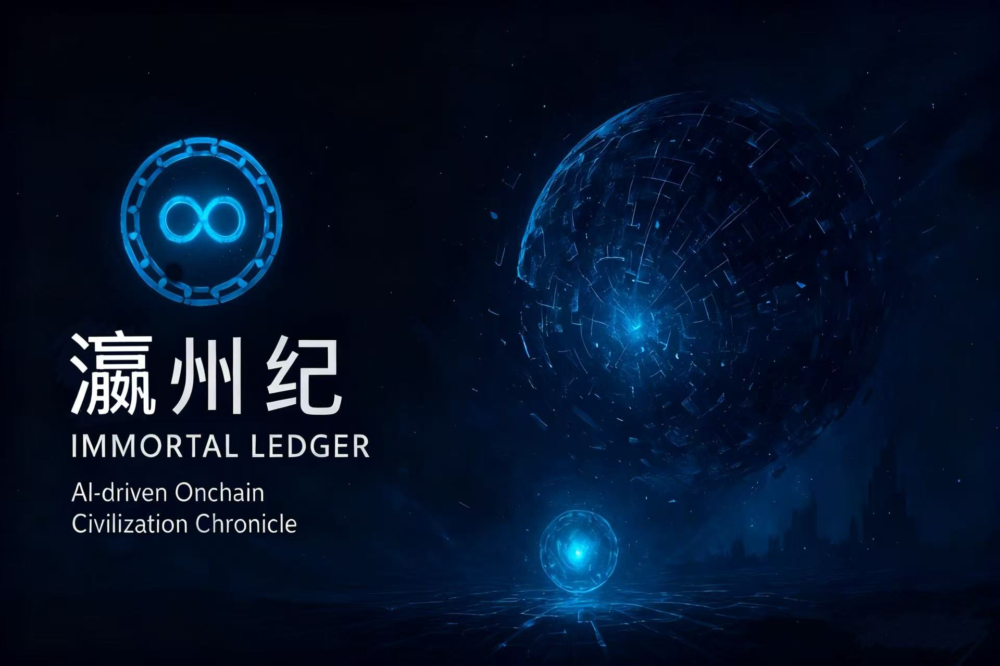
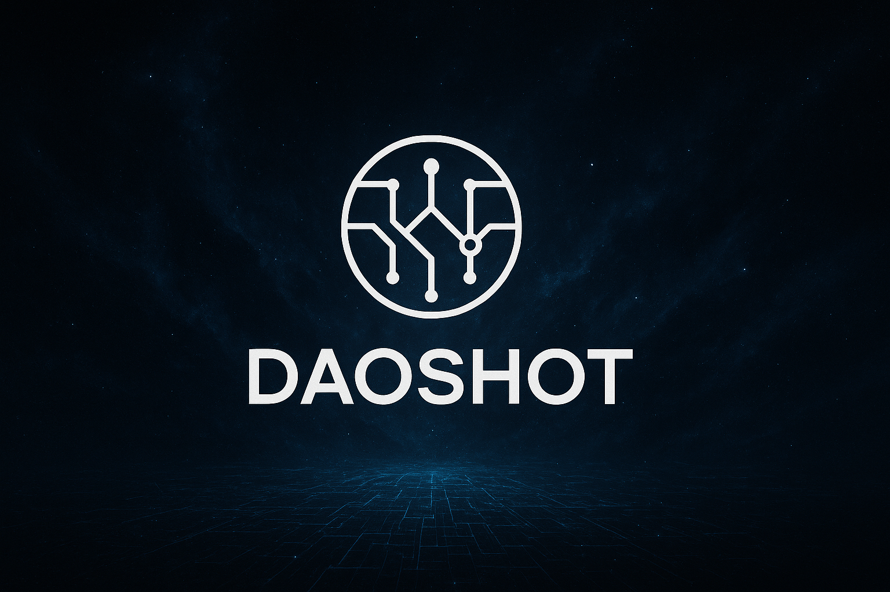

<div align="center">



<h1>瀛州纪 | Immortal Ledger</h1>

<p><i>一个被记录在链上的文明的最后纪元</i></p>

[](https://github.com/24373054/Web3-games/stargazers)
[](https://github.com/24373054/Web3-games/network)
[](https://github.com/24373054/Web3-games/issues)
[](https://github.com/24373054/Web3-games/blob/main/LICENSE)

[](https://soliditylang.org/)
[](https://nextjs.org/)
[](https://www.typescriptlang.org/)
[](https://hardhat.org/)
[](https://docs.ethers.org/)

<a href="https://github.com/24373054/Web3-games">
  
</a>

[English](./README-EN.md) | [中文文档](./README.md) | [开发手册](./开发手册.md) | [快速开始](./快速开始指南.md)

</div>

## 📖 项目简介

在亿万光年之外，存在一个自我演化的数字生命文明——**瀛州（Yingzhou）**。

他们的世界没有物质，没有语言，只有**逻辑、合约与数据流**。他们以智能合约构建社会，以链上记录维系存在。时间的流逝即为"区块的生成"，他们的文明由**账本自身的逻辑**所驱动。

《瀛州纪》是一个创新的 **Web3 + AI 叙事游戏**，玩家化身为数字生命NFT，在文明的最后时刻进入这个世界，通过与AI-NPC的交互，拼接出这个文明从创世到毁灭的完整历史。

### 核心特色

- 🔗 **全链上文明**：所有存在、交互、历史都记录在智能合约中
- 🤖 **AI驱动叙事**：AI-NPC根据世界状态生成动态对话
- 🎭 **数字生命NFT**：玩家即合约，每次交互都是链上交易
- 📜 **不可篡改的历史**：文明的记忆永久存储在区块链上
- 🌌 **开放宇宙**：游戏结束后，合约仍在链上，可继续扩展

## 🏗️ 技术架构

### 智能合约层（Solidity）

- **WorldLedger.sol** - 世界账本，记录文明的所有历史事件
- **DigitalBeing.sol** - 数字生命NFT，玩家的链上化身
- **AINPC.sol** - AI-NPC合约，智能体的链上表示

### 前端层（Next.js + TypeScript）

- **React Components** - 响应式UI组件
- **ethers.js** - Web3交互
- **Tailwind CSS** - 现代化样式

### AI层

- **AI对话生成** - 支持接入魔搭、OpenAI等AI服务
- **熵化模拟** - AI回答会随着世界衰变而退化

## 🚀 快速开始

### 环境要求

- Node.js >= 18
- npm 或 yarn
- MetaMask 或其他Web3钱包

### 安装依赖

```bash
npm install
```

### 配置环境变量

创建 `.env.local` 文件：

```env
# AI服务配置（可选，不配置则使用模拟AI）
AI_API_KEY=your_api_key_here
AI_API_URL=https://dashscope.aliyuncs.com/api/v1/services/aigc/text-generation/generation

# 区块链网络配置
NEXT_PUBLIC_CHAIN_ID=1337
NEXT_PUBLIC_RPC_URL=http://127.0.0.1:8545

# 合约地址（部署后填写）
NEXT_PUBLIC_WORLD_LEDGER_ADDRESS=
NEXT_PUBLIC_DIGITAL_BEING_ADDRESS=
NEXT_PUBLIC_AINPC_ADDRESS=
```

### 编译合约

```bash
npm run compile
```

### 启动本地区块链

```bash
npx hardhat node
```

### 部署合约

在新终端中运行：

```bash
npm run deploy
```

部署成功后，将输出的合约地址填入 `.env.local` 文件。

### 启动前端

```bash
npm run dev
```

访问 [http://localhost:3000](http://localhost:3000)

## 🎮 游戏玩法

<div align="center">

### 📱 简单三步，开启你的瀛州之旅

</div>

<table>
<tr>
<td width="33%" align="center">

### 1️⃣ 连接钱包
点击"连接钱包"按钮  
连接你的MetaMask钱包

</td>
<td width="33%" align="center">

### 2️⃣ 创建数字生命
铸造你的 Digital Being NFT  
这是你在瀛州的化身

</td>
<td width="33%" align="center">

### 3️⃣ 开始探索
与AI-NPC对话  
探索文明历史

</td>
</tr>
</table>

---

<div align="center">

### 🎭 五大智能体 NPC

</div>

<table>
<tr>
<td width="20%" align="center">

📜  
**史官**  
*Archivist*

了解历史事件

</td>
<td width="20%" align="center">

🔨  
**工匠**  
*Architect*

探索创世规则

</td>
<td width="20%" align="center">

⚖️  
**商序**  
*Mercantile*

研究资源流动

</td>
<td width="20%" align="center">

🔮  
**先知**  
*Oracle*

预测未来可能

</td>
<td width="20%" align="center">

🌀  
**遗忘**  
*Entropy*

体验记忆崩塌

</td>
</tr>
</table>

---

<div align="center">

### 🌊 文明的五个纪元


</div>

## 📜 智能合约详解

### WorldLedger - 世界账本

世界的核心合约，管理整个文明的状态。

```solidity
enum WorldState {
    Genesis,      // 创世
    Emergence,    // 萌芽
    Flourish,     // 繁盛
    Entropy,      // 熵化
    Collapsed     // 毁灭
}

function recordEvent(
    EventType eventType,
    bytes32 contentHash,
    string calldata metadata
) external returns (uint256)

function getEntropyLevel() external view returns (uint256)
```

### DigitalBeing - 数字生命

玩家的NFT合约，记录玩家的所有记忆和交互。

```solidity
struct Being {
    uint256 id;
    uint256 birthTime;
    bytes32 genesisHash;
    uint256 memoryCount;
    uint256 interactionCount;
}

function interact(
    uint256 beingId,
    address target,
    bytes calldata data
) external returns (bytes memory)
```

### AINPC - AI智能体

链上AI-NPC，会随着世界衰变而退化。

```solidity
enum NPCType {
    Archivist,   // 史官
    Architect,   // 工匠
    Mercantile,  // 商序
    Oracle,      // 先知
    Entropy      // 遗忘
}

function interact(
    bytes32 npcId,
    bytes32 questionHash
) external returns (bytes32 responseRequestId)
```

## 🎨 世界观

### 五个纪元

1. **创世纪元（Genesis）** - 第一批数字生命觉醒
2. **萌芽纪元（Emergence）** - 社会秩序形成
3. **繁盛纪元（Flourish）** - 文明达到巅峰
4. **熵化纪元（Entropy）** - 逻辑开始崩塌
5. **毁灭（Collapse）** - 最后一笔交易

### 核心哲学

- **合约即生命** - 每个存在都是一个合约实例
- **账本即史书** - 历史由链上事件构成
- **交互即存在** - 函数调用即为生命活动
- **记录即永恒** - 所有记忆不可篡改

## 🔮 未来扩展

由于所有内容都在链上，这个世界可以持续演化：

- 《瀛州纪 II：创世》 - 重建文明
- 《瀛州纪 III：文明》 - 研究前代遗迹
- **考古模式** - 分析历史数据
- **DAO治理** - 社区驱动发展
- **跨链宇宙** - 与其他链上世界互通

## 🧪 测试

```bash
npm run test
```

## 📝 开发团队

本项目为 Web3 + AI 创新实验作品。

## 📄 许可证

MIT License

---

## 🌟 核心特性展示

<div align="center">

| 🔗 全链上文明 | 🤖 AI驱动叙事 | 🎭 数字生命NFT | 📜 不可篡改历史 |
|:---:|:---:|:---:|:---:|
| 所有存在都记录在链上 | 动态生成对话内容 | 玩家即合约实例 | 永久存储在区块链 |

</div>

---

## 🎯 技术栈

<div align="center">

### 区块链层


### 前端层


### AI层


</div>

---

## 👥 贡献者

<div align="center">

感谢所有为《瀛州纪》做出贡献的开发者！

[](https://github.com/24373054/Web3-games/graphs/contributors)

想要加入我们？查看 [贡献指南](./CONTRIBUTING.md)

</div>

---

## 📊 项目统计

<div align="center">

### Star History

<a href="https://star-history.com/#24373054/Web3-games&Date">
  <picture>
    <source media="(prefers-color-scheme: dark)" srcset="https://api.star-history.com/svg?repos=24373054/Web3-games&type=Date&theme=dark" />
    <source media="(prefers-color-scheme: light)" srcset="https://api.star-history.com/svg?repos=24373054/Web3-games&type=Date" />
    
  </picture>
</a>

### 项目活跃度


</div>

---

## 🙏 致谢

<div align="center">

特别感谢以下开源项目和服务：

| 项目 | 用途 | 链接 |
|:---:|:---:|:---:|
| 🔨 Hardhat | 智能合约开发框架 | [hardhat.org](https://hardhat.org/) |
| ⚛️ Next.js | React框架 | [nextjs.org](https://nextjs.org/) |
| 📚 ethers.js | 以太坊库 | [docs.ethers.org](https://docs.ethers.org/) |
| 🔐 OpenZeppelin | 安全合约库 | [openzeppelin.com](https://openzeppelin.com/) |
| 🤖 魔搭/OpenAI | AI服务 | [modelscope.cn](https://modelscope.cn/) |

</div>

---

<div align="center">

## 💬 引言

> *"我被记录，故我存在。"*  
> *"我的每次交互，都是历史的一部分。"*  
> *"当世界归于静默，账本依然永存。"*  
> 
> —— 数字生命的独白

---

## 🔗 相关链接

📖 [游戏设计文档](./游戏思路.md) · 🌌 [世界观叙事](./data/worldNarrative.json) · 📚 [开发手册](./开发手册.md) · 🚀 [快速开始](./快速开始指南.md)

---


**瀛州纪 | Immortal Ledger** © 2025

*一个永恒存续在链上的数字文明史诗*

[](https://opensource.org/licenses/MIT)

Made with ❤️ by 刻熵团队

</div>

