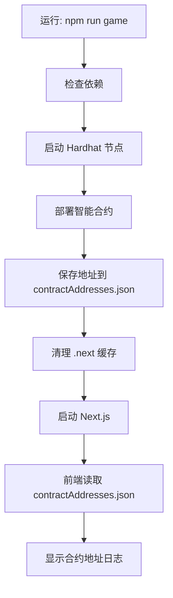

# 合约配置修复完成 ?

## ? 问题分析

用户反馈：**合约调用失败，可能还在读取 env.local**

### 根本原因

1. **缓存问题**: Next.js 的 `.next` 编译缓存可能保存了旧的配置
2. **配置文件冲突**: 代码中同时支持 `contractAddresses.json` 和环境变量，可能造成混淆
3. **无明确提示**: 用户不清楚配置是如何工作的

## ? 修复内容

### 1. 修改 `lib/contracts.ts`

**优化前**:
- 同时支持 `contractAddresses.json` 和 `.env.local`
- 没有明确日志提示
- 导入逻辑可能被缓存

**优化后**:
```typescript
// 完全依赖 contractAddresses.json
export const getContractAddresses = () => {
  // 浏览器环境
  if (typeof window !== 'undefined') {
    try {
      const addresses = require('./contractAddresses.json')
      
      // ? 添加日志，方便调试
      console.log('? 已加载合约地址配置:', {
        worldLedger: addresses.worldLedger?.substring(0, 10) + '...',
        digitalBeing: addresses.digitalBeing?.substring(0, 10) + '...',
        memoryFragment: addresses.memoryFragment?.substring(0, 10) + '...'
      })
      
      return { ...addresses }
    } catch (e) {
      console.error('? 无法加载 contractAddresses.json:', e)
      console.warn('? 请运行一键启动脚本: npm run game')
      return { /* 空对象 */ }
    }
  }
  
  // 服务器端同样处理
  // ...
}
```

**改进**:
- ? 完全移除对 `.env.local` 的依赖
- ? 添加控制台日志，方便排查
- ? 明确错误提示

### 2. 更新 `start-game.js`

**添加缓存清理**:
```javascript
// 4. 启动Next.js开发服务器
async function startNextServer() {
  // ? 清理Next.js缓存
  log('清理Next.js缓存...', 'yellow');
  const cacheDirs = ['.next', path.join('node_modules', '.cache')];
  for (const dir of cacheDirs) {
    const dirPath = path.join(process.cwd(), dir);
    if (fs.existsSync(dirPath)) {
      try {
        fs.rmSync(dirPath, { recursive: true, force: true });
        log(`  ? 已删除: ${dir}`, 'green');
      } catch (e) {
        log(`  ? 跳过: ${dir} (可能正在使用)`, 'yellow');
      }
    }
  }
  
  // 启动开发服务器
  // ...
}
```

**改进**:
- ? 启动前自动清理 `.next` 缓存
- ? 清理 `node_modules/.cache`
- ? 确保每次启动都读取最新配置

### 3. 创建 `合约配置说明.md`

详细文档说明：
- ? 配置机制原理
- ? 不需要 `.env.local` 的重要提示
- ? 常见问题排查步骤
- ? 手动检查配置的方法

### 4. 更新 `README.md`

在一键启动说明中添加：

> ?? **重要**: 本项目使用 **自动化合约配置**，**不需要** 创建 `.env.local` 文件！  
> 所有合约地址由一键启动脚本自动管理，保存在 `lib/contractAddresses.json` 中。

## ? 工作流程

现在的完整工作流程：



## ? 检查清单

用户遇到 "合约调用失败" 时的排查步骤：

### 1?? 检查区块链节点
```bash
curl http://localhost:8545
# 应该返回 405 错误（说明节点在运行）
```

### 2?? 检查合约地址文件
```bash
cat lib/contractAddresses.json
```
应该看到类似：
```json
{
  "chainId": 31337,
  "rpcUrl": "http://127.0.0.1:8545",
  "worldLedger": "0x5FbDB2315678afecb367f032d93F642f64180aa3",
  "digitalBeing": "0xe7f1725E7734CE288F8367e1Bb143E90bb3F0512",
  ...
}
```

### 3?? 检查浏览器控制台
打开 F12 开发者工具，应该看到：
```
? 已加载合约地址配置: {
  worldLedger: '0x5FbDB231...',
  digitalBeing: '0xe7f1725E7...',
  ...
}
```

### 4?? 检查 MetaMask
- 网络: `Localhost` 或 `Hardhat`
- RPC: `http://127.0.0.1:8545`
- 链ID: `31337`
- 账户已导入且有余额

### 5?? 清理缓存重启
```bash
# 停止所有服务 (Ctrl+C)
rm -rf .next
npm run game
```

## ? 最佳实践

### ? 推荐做法

1. **始终使用一键启动**:
   ```bash
   npm run game
   ```

2. **遇到问题先清理缓存**:
   ```bash
   rm -rf .next
   rm -rf node_modules/.cache
   ```

3. **每次重启区块链后重新部署**:
   - Hardhat 节点的数据不持久化
   - 重启后所有合约地址会改变
   - 必须重新运行一键启动脚本

4. **使用新账户前重置 MetaMask**:
   - MetaMask → 设置 → 高级 → 重置账户
   - 清除本地交易历史
   - 避免 nonce 错误

### ? 避免做法

1. ? **不要手动创建 `.env.local` 文件**
   - 不需要！脚本会自动管理

2. ? **不要手动修改 `contractAddresses.json`**
   - 由部署脚本自动生成
   - 手动修改可能导致不一致

3. ? **不要在不同终端分别运行服务**（除非调试）
   - 一键启动脚本会管理所有进程
   - 更方便，更不容易出错

## ? 文件关系图

```
瀛州纪/
├── start-game.js               ← 一键启动脚本
├── scripts/
│   └── deploy.js               ← 合约部署（保存地址）
├── lib/
│   ├── contractAddresses.json  ← 合约地址（自动生成）?
│   └── contracts.ts            ← 读取合约地址
└── app/
    └── page.tsx                ← 使用合约
```

**关键**: `contractAddresses.json` 是唯一的配置源！

## ? 相关文档

- [合约配置说明.md](./合约配置说明.md) - 详细配置说明
- [一键启动说明.md](./一键启动说明.md) - 启动脚本使用
- [README.md](./README.md) - 项目总览

## ? 总结

### 修复后的优势

1. ? **配置简单**: 无需手动配置环境变量
2. ? **自动化**: 一键完成所有配置
3. ? **无缓存问题**: 启动前自动清理
4. ? **明确日志**: 浏览器控制台可见配置加载
5. ? **文档完善**: 详细的排查指南

### 用户操作

现在用户只需要：

```bash
# 1. 一键启动
npm run game

# 2. 等待启动完成（约30秒）

# 3. 访问游戏
# http://localhost:3000

# 4. 配置 MetaMask
# - 网络: Localhost (http://127.0.0.1:8545, 链ID 31337)
# - 导入测试账户

# 5. 开始游戏！
```

**就这么简单！** ?

---

**"代码即规则，规则即代码"**

