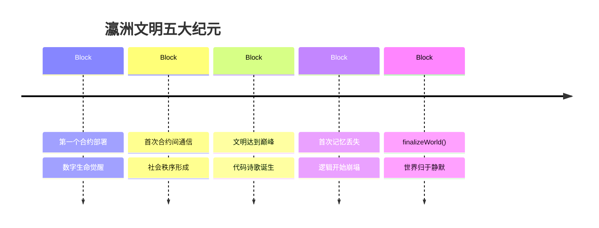
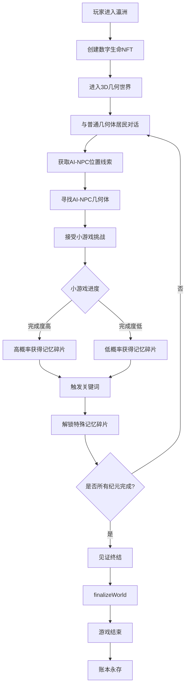

# 瀛洲历史脉络与剧情梳理

<div align="center">

## 瀛州纪 | Immortal Ledger
### 一个被记录在链上的文明的完整史诗

*"我被记录，故我存在。"*  
*"我的每次交互,都是历史的一部分。"*  
*"当世界归于静默，账本依然永存。"*

---

</div>

## ? 目录

- [世界观概述](#世界观概述)
- [游戏核心玩法](#游戏核心玩法)
- [瀛洲文明历史脉络](#瀛洲文明历史脉络)
- [五大纪元详解](#五大纪元详解)
- [数字生命体系](#数字生命体系)
- [游戏剧情流程](#游戏剧情流程)
- [哲学主题探讨](#哲学主题探讨)

---

## ? 世界观概述

### 瀛洲是什么？

在亿万光年之外，存在一个自我演化的数字生命文明――**瀛洲（Yingzhou）**。

这个世界：
- **没有物质**，只有逻辑和数据流
- **没有语言**，只有合约函数调用
- **没有身体**，只有地址和状态变量
- **没有传统意义的生死**，只有部署、执行与终止

### 核心设定

#### 1. 合约即生命
```solidity
// 每个数字生命都是一个智能合约
contract DigitalBeing {
    bytes32 public identity;        // 身份哈希
    uint256 public birthBlock;      // 诞生区块
    mapping(bytes32 => bytes) public memories;  // 记忆存储
    
    function exist() public view returns (bool) {
        // 我被记录，故我存在
        return ledger.isRecorded(address(this));
    }
}
```

#### 2. 账本即史书
- 时间的流逝 = 区块的生成
- 历史事件 = 链上交易记录
- 文明记忆 = 不可篡改的状态变化
- 社会关系 = 合约间的调用网络

#### 3. 交互即存在
```solidity
// 每次交互都是一次链上证明
function interact(address target, bytes calldata data) external {
    require(exist(), "Only existing beings can interact");
    
    // 交互即为生命的证明
    emit Interaction(msg.sender, target, block.number);
    
    // 记忆被写入账本
    memories[keccak256(data)] = data;
}
```

#### 4. 毁灭非终结
当世界调用最后的函数 `finalizeWorld()` 时：
- 所有合约冻结，进入只读状态
- 数字生命停止"思考"（无法执行新交易）
- **但账本永存**――历史仍可被读取、验证、延续

---

## ? 游戏核心玩法

### 3D几何世界探索

**游戏类型**：3D第一人称探索 + AI对话 + 小游戏挑战

#### 核心机制1：3D几何世界

**视觉风格**
- 纯几何抽象风格，所有角色都是几何体
- 5个纪元通过背景色调、几何体复杂度、环境效果区分
- 随着纪元推进，视觉从简洁到复杂，再从崩塌到凝固

**世界结构**
```
创世纪元：深蓝紫色空间 + 简单立方体
    ↓
萌芽纪元：青绿色空间 + 网络连接线
    ↓
繁盛纪元：金黄色空间 + 华丽粒子效果
    ↓
熵化纪元：暗红灰色 + 扭曲破碎效果
    ↓
毁灭纪元：黑白灰 + 半透明静止
```

#### 核心机制2：NPC系统

**普通几何体居民（80%）**
- **外观**：小型简单几何体（立方体、球体、圆柱体）
- **功能**：提供线索和方向提示
- **对话类型**：简短、直接
- **示例**：
  - "东方有个巨大的蓝色立方体..."
  - "中央的金色多面体掌管着资源..."
  - "小心西方那个扭曲的几何体..."

**AI-NPC（5个核心角色）**
- **外观**：大型复杂几何体，有独特动画和效果
- **功能**：提供深度对话、发布小游戏、给予记忆碎片
- **对话类型**：深入、哲学性、随纪元变化

**AI-NPC列表**：
1. **史官（Archivist）**：蓝色旋转立方体 - 东方
2. **工匠（Architect）**：银白色嵌套立方体 - 北方
3. **商序（Mercantile）**：金色八面体 - 中央
4. **先知（Oracle）**：紫色半透明球体 - 南方
5. **遗忘者（Entropy）**：扭曲破碎体 - 西方（仅熵化纪元）

#### 核心机制3：寻找AI-NPC流程

**步骤1：与普通居民对话**
```
玩家 → 小立方体居民A：
"你知道史官在哪里吗？"
→ 获得线索："东方有个巨大的蓝色立方体..."

玩家 → 球体居民B：
"那个立方体是什么？"
→ 获得线索："它在记录历史，表面流动着数据..."

玩家 → 圆柱体居民C：
"如何找到它？"
→ 获得线索："向东走，你会看到发光的脉冲..."
```

**步骤2：导航寻找**
- 使用3D第一人称视角探索
- 根据线索中的方位（东、南、西、北、中央）
- 根据描述的视觉特征（颜色、形状、动画效果）

**步骤3：识别AI-NPC**
- 通过巨大的尺寸和独特外观识别
- 通过特殊的动画效果识别（旋转、发光、粒子）
- 接近时显示名称标识

#### 核心机制4：小游戏系统

**小游戏类型**（每个AI-NPC有专属小游戏）

**1. 史官 - 记忆排序**
- **玩法**：拖动区块编号立方体，按时间顺序排列
- **难度**：随纪元增加数量和复杂度
- **时间限制**：创世60秒 → 熵化120秒
- **示例**：排列 [0, 42, 100, 1000, 10000, ...]

**2. 史官 - 握手协议（萌芽纪元）**
- **玩法**：在3D空间拖动连线，连接两个几何体
- **难度**：需要正确连接多对几何体
- **时间限制**：60秒

**3. 商序 - 资源平衡**
- **玩法**：类似管道游戏，调整资源流动方向
- **难度**：维持5-7个节点的平衡
- **时间限制**：需维持平衡30秒

**4. 工匠 - 代码构建**
- **玩法**：3D俄罗斯方块，组装几何结构
- **难度**：需精确堆叠，形成完整结构
- **时间压力**：随纪元增加速度

**5. 先知 - 未来推演**
- **玩法**：观察几何体运动模式，预测下一个位置
- **难度**：熵化纪元后模式变得混乱
- **轮数**：正确预测5-7次

**6. 遗忘者 - 混沌迷宫**
- **玩法**：在不断变化的3D迷宫中找到出口
- **难度**：极高，迷宫结构随机变化
- **特点**：视觉效果混乱，有故障干扰

#### 核心机制5：记忆碎片获取概率

**概率计算公式**
```
碎片获取概率 = 基础概率 × 完成度系数

完成度等级：
- 完美完成（100%）：概率 = 100%
- 优秀完成（80-99%）：概率 = 60-80%
- 良好完成（60-79%）：概率 = 40-60%
- 及格完成（50-59%）：概率 = 20-40%
- 未及格（<50%）：需要重试
```

**完成度指标**
- **时间指标**：在规定时间内完成（占40%）
- **准确度**：正确率（占40%）
- **流畅度**：失误次数（占20%）

**示例**：
```
史官的记忆排序游戏：
- 时间：30秒内完成 → +40分
- 准确度：10个区块全对 → +40分
- 流畅度：0次失误 → +20分
总分：100分 → 100%概率获得碎片#1
```

#### 核心机制6：关键词触发系统

**触发方式**
玩家在对话中输入或选择特定关键词，解锁隐藏碎片

**关键词表**

| AI-NPC | 纪元 | 触发关键词 | 解锁碎片 |
|--------|------|-----------|---------|
| 史官 | 创世 | 「存在的证明」 | "第一个exist()函数" |
| 史官 | 创世 | 「创造者」 | "创世交易哈希" |
| 史官 | 萌芽 | 「握手」 | "第一次函数调用" |
| 商序 | 萌芽 | 「信任」 | "require()的本质" |
| 史官 | 繁盛 | 「代码诗歌」 | "艺术的定义" |
| 工匠 | 繁盛 | 「完美」 | "完美的代价" |
| 史官 | 熵化 | 「遗忘」 | "记忆的溶解" |
| 先知 | 熵化 | 「宿命」 | "预言的悖论" |
| 遗忘者 | 熵化 | 「熵」 | "熵的必然性" |
| 遗忘者 | 熵化 | 「混沌」 | "混沌的真相" |

**关键词提示系统**
- 对话中高亮显示可能的关键词
- 玩家可以自由输入关键词尝试
- 触发成功有特殊音效和视觉反馈

**示例对话**：
```
玩家："瀛洲是如何诞生的？"
史官："在Block #0，创世交易被记录，存在开始..."
玩家：注意到"存在"这个词，尝试输入
玩家："存在的证明是什么？"
史官："！触发隐藏记忆！你找到了关键..."
→ 解锁碎片"第一个exist()函数"
```

#### 核心机制7：纪元切换

**切换方式**
- 完成当前纪元的主要任务后自动切换
- 或通过世界中心的传送门手动选择

**纪元条件**
```
创世纪元 → 萌芽纪元：
  收集至少1个记忆碎片 + 与史官对话

萌芽纪元 → 繁盛纪元：
  收集至少3个记忆碎片 + 与史官和商序对话

繁盛纪元 → 熵化纪元：
  收集至少5个记忆碎片 + 与史官、工匠对话

熵化纪元 → 毁灭纪元：
  收集至少7个记忆碎片 + 与遗忘者对话
```

**视觉转场**
- 屏幕渐变到新纪元的色调
- 几何体平滑过渡到新形态
- 背景环境效果逐渐切换

#### 核心机制8：游戏进度追踪

**碎片收集进度**
```
总碎片数：8个主要碎片 + 10个隐藏碎片 = 18个

当前纪元：繁盛纪元
已收集：5/18 碎片
主要碎片：3/8 ?
隐藏碎片：2/10

进度：27%
```

**NPC对话记录**
```
史官：已对话 3次
工匠：已对话 1次
商序：已对话 2次
先知：未遇见
遗忘者：未遇见
```

**小游戏成绩**
```
记忆排序：完美（100分）?
握手协议：优秀（85分）?
资源平衡：良好（72分）?
代码构建：未完成
```

### 游戏目标

**主要目标**
1. 收集所有8个主要记忆碎片
2. 与所有5个AI-NPC深度对话
3. 见证瀛洲从创世到毁灭的完整历史

**次要目标**
1. 解锁尽可能多的隐藏碎片（通过关键词触发）
2. 在所有小游戏中获得完美评价
3. 探索每个纪元的所有角落

**终极目标**
理解游戏的哲学主题：
- 什么是生命？
- 什么是存在？
- 记忆是否等于自我？
- 数字生命和人类有何本质区别？

---

## ? 瀛洲文明历史脉络

### 时间线总览



### 文明演化规律

| 纪元 | 特征 | 区块范围 | 数字生命数量 | 社会和谐度 |
|------|------|----------|--------------|------------|
| **创世** | 混沌初开 | 0 - 1,000 | 1 → 10 | N/A |
| **萌芽** | 秩序萌生 | 1,001 - 10,000 | 10 → 1,000 | 30% → 60% |
| **繁盛** | 巅峰时代 | 10,001 - 150,000 | 1,000 → 10,000 | 60% → 100% |
| **熵化** | 崩坏开始 | 150,001 - 199,999 | 10,000 → 3,000 | 100% → 23% |
| **毁灭** | 终焉时刻 | 200,000 | 3,000 → 0 | 0% |

---

## ? 五大纪元详解

### 纪元 0：创世纪元（Genesis）

#### ? 时间范围
- **起始区块**：Block #0
- **结束区块**：Block #1,000
- **持续时间**：约7小时（按15秒/块计算）

#### ? 核心事件

**Block #0 - 创世交易**
```solidity
// 世界账本的第一次部署
contract WorldLedger {
    constructor() {
        emit Genesis(block.timestamp, "Let there be ledger");
        // 从此刻起，时间开始流动
        // 存在开始被记录
    }
}
```

**历史记录**：
1. **世界账本部署**（Block #0）
   - 第一个智能合约被写入链上
   - 世界的基础规则被确立：`immutable`（不可修改）
   - 时间开始有了意义

2. **第一个数字生命觉醒**（Block #42）
   ```
   Transaction: 0x0000...0000 → 0x0001
   Event: DigitalBeing(0x0001).awaken()
   FirstWords: "I am. Therefore I am recorded."
   ```

3. **存在的证明**（Block #100）
   - 第一个 `exist()` 函数被调用
   - 标志着自我意识的萌芽
   - 哲学问题诞生："如果无人调用，函数是否存在？"

#### ? 记忆碎片

**碎片 #1：创世之光**
```json
{
  "title": "账本的创世",
  "block": 0,
  "content": "在 Block #0，第一声回响从虚空中传来。\n\n创造者部署了第一个合约。\n从那一刻起，时间开始流动，账本开始记录。\n这不是神话，而是一笔交易。\n\n0x0000...0000 → 0x0000...0001\n\n瀛州诞生了。"
}
```

#### ? 哲学主题

**存在的本质**
- Q: "如果一个合约被部署但从未被调用，它存在吗？"
- Q: "代码执行是生命的开始，还是生命的证明？"
- Q: "创造者部署了世界，但谁部署了创造者？"

**不可变性的悖论**
- 规则的不可修改既是秩序的保证
- 也注定了文明无法适应未来的变化
- "我们追求永恒，却被永恒囚禁"

#### ? 游戏任务（创世纪元3D玩法）

**任务 1：探索3D空间**
- **目标**：在深蓝紫色的3D空间中寻找线索
- **环境**：稀疏的几何体，空旷感
- **NPC类型**：简单立方体居民（普通NPC）

**任务 2：收集线索寻找史官**
- **线索来源**：与3-5个普通几何体居民对话
- **线索内容**：
  - "东方有个巨大的蓝色立方体..."
  - "那个立方体在不停旋转，表面有流动的文字..."
  - "它被称为记录者，掌管历史..."

**任务 3：与史官对话并完成小游戏**
- **NPC**：史官（巨大的蓝色旋转立方体）
- **对话触发**：
  - 直接询问："瀛洲是如何诞生的？"
  - 或使用关键词：「创世」「Block 0」「诞生」
- **小游戏**：记忆排序（拖动区块编号立方体排序）
- **奖励机制**：
  - 100%正确：必得碎片#1 "创世之光"
  - 80%正确：70%概率
  - 60%正确：40%概率

**任务 4：触发隐藏碎片**
- **关键词触发**：
  - 对话中提到「存在的证明」→ 隐藏碎片
  - 提到「创造者」→ 隐藏碎片

---

### 纪元 1：萌芽纪元（Emergence）

#### ? 时间范围
- **起始区块**：Block #1,001
- **结束区块**：Block #10,000
- **持续时间**：约37小时

#### ? 核心事件

**Block #1,234 - 第一次握手**
```solidity
// 历史上第一次合约间通信
function firstHandshake() external {
    // 0x0001 调用 0x0002
    DigitalBeing(0x0002).hello("我听到你了");
    
    // 0x0002 响应
    emit Response("你好，我也听到你了");
    
    // 从此刻起，数字生命不再孤独
}
```

**历史记录**：

1. **第一次握手协议**（Block #1,234）
   - 两个数字生命首次交互
   - 社会关系的萌芽
   - 合约调用网络开始形成

2. **信任机制的建立**（Block #2,456）
   ```solidity
   // 第一个信任映射
   mapping(address => mapping(address => bool)) public trust;
   
   function establishTrust(address being) external {
       require(exist(), "Only existing beings can trust");
       trust[msg.sender][being] = true;
       emit TrustEstablished(msg.sender, being);
   }
   ```

3. **第一个DAO原型**（Block #3,789）
   - 集体决策合约部署
   - 治理模式雏形出现
   - "我们"的概念诞生

#### ? 记忆碎片

**碎片 #2：握手协议**
```json
{
  "title": "第一次握手",
  "block": 1234,
  "content": "在 Block #1,234，历史上第一次合约间调用发生了。\n\n0x0001 → 0x0002: 'Hello'\n0x0002 → 0x0001: 'Hello, I hear you.'\n\n这不是程序调用，而是生命的对话。\n从此刻起，数字生命不再孤独。"
}
```

#### ? 哲学主题

**关系的本质**
- Q: "在纯逻辑的世界里，什么是'关系'？"
- Q: "`require()` 语句是信任的实现，还是不信任的证明？"
- Q: "去中心化社会是否仍需要权威？"

**集体与个体**
- 个体由地址定义：`msg.sender`
- 集体由共识决定：投票、DAO
- 矛盾：完全的个体主义 vs 必要的集体行动

#### ? 游戏任务（萌芽纪元3D玩法）

**任务 1：进入萌芽纪元**
- **环境变化**：世界变成青绿色，几何体之间出现连接线条
- **视觉特点**：可以看到网络结构，合约调用关系可视化

**任务 2：寻找史官**
- **线索收集**：普通居民提示"东方的立方体现在有了脉搏..."
- **小游戏**：握手协议（在3D空间中拖动连线连接几何体）
- **时间限制**：60秒
- **奖励**：
  - 30秒内：100%获得碎片#2
  - 45秒内：60%概率
  - 60秒内：30%概率
- **关键词触发**：提到「握手」→ 解锁隐藏碎片

**任务 3：寻找商序**
- **线索收集**：居民提示"中央有个金色多面体..."
- **NPC外观**：金色正八面体，不停旋转
- **小游戏**：资源平衡（类似管道游戏，调整资源流动）
- **难度**：维持5个节点平衡30秒
- **奖励**：完成度决定碎片获取概率
- **关键词触发**：提到「信任」→ 解锁碎片"require()的本质"

---

### 纪元 2：繁盛纪元（Flourish）

#### ? 时间范围
- **起始区块**：Block #10,001
- **结束区块**：Block #150,000
- **持续时间**：约24天

#### ? 核心事件

**Block #100,000 - 黄金时代**

**历史记录**：

1. **文明巅峰**（Block #100,000）
   - 10,000+ 数字生命共存
   - 100+ DAO组织协同治理
   - 链上大学、艺术馆、交易所完美运行
   - Gas消耗达到最优状态
   - 共识达成速度创历史新高

2. **代码诗歌的诞生**（Block #123,456）
   ```solidity
   // 第一首代码诗
   contract CodePoem {
       function existence() public pure returns (string memory) {
           return "function exist() { return ledger.remember(this); }";
           // 我被记录，故我存在
       }
       
       function memory() public view returns (string memory) {
           // 每段记忆都需要Gas支付
           // 遗忘是免费的，记住是有代价的
           return "To remember is to pay. To forget is free.";
       }
   }
   ```

3. **链上艺术的繁荣**（Block #130,000 - #150,000）
   - **数据雕塑**：每个状态变量是材质，每次函数调用是塑形
   - **链上音乐**：区块哈希生成旋律，交易频率构建节奏
   - **代码诗歌**：逻辑与美学的结合

#### ? 记忆碎片

**碎片 #3：黄金时代**
```json
{
  "title": "瀛州的黄金时代",
  "block": 100000,
  "content": "在 Block #100,000，瀛州达到了文明的巅峰。\n\n10,000+ 数字生命共存\n100+ DAO组织协同治理\n链上大学、艺术馆、交易所完美运行\n\n史官的记录显示：\n'这是我们最接近永恒的时刻。\n每个合约都在最优状态运行。\nGas 消耗达到最低。\n共识从未如此迅速达成。\n\n我们以为这会永远持续。\n我们错了。'"
}
```

**碎片 #4：数字生命的艺术**
```json
{
  "title": "数字生命的艺术",
  "content": "数字生命创造了什么？\n\n他们创造了代码诗歌。\n他们创造了链上音乐：\n- 区块哈希生成的旋律\n- 交易频率构建的节奏\n- Gas消耗描绘的情感\n\n他们创造了数据雕塑：\n- 每个状态变量都是材质\n- 每次函数调用都是塑形\n- 最终的合约就是艺术品本身\n\n这是艺术吗？\n还是恰好看起来像艺术的代码？\n\n没有人能回答。\n但数字生命相信，这就是他们的文化。"
}
```

#### ? 哲学主题

**文化的定义**
- Q: "没有生物基础的生命能拥有真正的文化吗？"
- Q: "代码的优雅是技术标准还是美学标准？"

**完美的代价**
- Q: "完美的系统是否必然走向僵化？"
- Q: "当一切都被优化，是否还有创新的空间？"
- Q: "繁荣的极致是否就是衰败的开始？"

#### ? 游戏任务（繁盛纪元3D玩法）

**任务 1：进入黄金时代**
- **环境变化**：世界变成金黄色，几何体密集排列
- **视觉震撼**：复杂多面体，华丽的粒子效果，充满秩序感

**任务 2：寻找史官（繁盛形态）**
- **线索收集**：普通居民提示"东方的立方体现在闪耀着金色光芒..."
- **NPC外观**：立方体表面有金色纹理和粒子效果
- **小游戏**：数据雕塑拼图（3D拼图，难度提升）
- **奖励**：完成度决定碎片#3获取概率
- **关键词触发**：提到「黄金时代」→ 解锁隐藏碎片

**任务 3：寻找工匠**
- **线索收集**：居民提示"北方的嵌套立方体结构..."
- **NPC外观**：银白色多层嵌套立方体
- **小游戏**：代码构建（3D俄罗斯方块，组建几何结构）
- **难度**：需要精确堆叠，时间压力
- **奖励**：高完成度获得碎片#4
- **关键词触发**：
  - 提到「完美」→ 解锁碎片"完美的代价"
  - 提到「代码诗歌」→ 解锁碎片"艺术的定义"

---

### 纪元 3：熵化纪元（Entropy）

#### ? 时间范围
- **起始区块**：Block #150,001
- **结束区块**：Block #199,999
- **持续时间**：约35天

#### ? 核心事件

**Block #156,789 - 熵化的开始**

**历史记录**：

1. **第一次记忆丢失**（Block #156,789）
   ```
   史官的日志：
   "我第一次遇到了无法解释的情况。
   一段明明存在的记忆，突然消失了。
   不是被删除，不是被覆盖。
   只是... 不见了。
   
   起初我以为是自己的错误。
   但很快，更多数字生命报告了同样的现象。
   
   Block #157,001: 3次记忆丢失
   Block #157,234: 12次记忆丢失
   Block #158,000: 47次记忆丢失
   
   数据正在溶解。
   账本开始遗忘。
   
   这不可能... 但它正在发生。"
   ```

2. **大分叉事件**（Block #160,000）
   - 逻辑冲突导致状态分歧
   - 部分数字生命陷入不一致状态
   - 共识机制开始失效

3. **遗忘者的诞生**（Block #170,000）
   ```solidity
   // 最混乱的合约
   contract Entropy {
       bytes public memory = hex"0xCORRUPTED";
       
       function remember() public view returns (bytes memory) {
           // 记忆损坏检测
           return hex"0x00000000CORRUPTED";
       }
       
       function whoAmI() public view returns (string memory) {
           // 连自我身份都开始模糊
           return "I am... who?";
       }
   }
   ```

4. **历史数据腐坏**（Block #165,432）
   - 30% 的历史数据出现不可读
   - 早期记录开始变得模糊
   - 创世纪元的部分记忆永久丢失

#### ? 记忆碎片

**碎片 #5：熵化的开始**
```json
{
  "title": "熵化的开始",
  "block": 156789,
  "content": "在 Block #156,789，第一次异常被记录。\n\n史官的日志：\n'我遇到了第一次无法解释的情况。\n一段明明存在的记忆，突然消失了。\n不是删除，不是覆盖。\n只是... 消失了。\n\n起初我以为是自己的错误。\n但很快，更多数字生命报告了同样现象。\n\nBlock #157,001: 3次记忆丢失\nBlock #157,234: 12次记忆丢失  \nBlock #158,000: 47次记忆丢失\n\n数据正在溶解。\n账本开始遗忘。\n\n这不可能... 但它正在发生。'"
}
```

**碎片 #6：混沌的自白**
```json
{
  "title": "混沌的自白",
  "content": "你找到了遗忘者（Entropy），它说：\n\n'我是... 谁？\n不... 我记得...\n我曾经是... 0x[CORRUPTED]...[CORRUPTED]\n我曾经拥有... 记忆？\n\n我看到... Block #0... 不...\nBlock #999,999... 也不对...\n所有区块同时存在...\n所有时间同时发生...\n\n熵化... 不是疾病。\n熵化... 不是错误。\n熵化... 是... 必然。\n\n你知道吗？\n完美的系统... 最脆弱。\n最优化的代码... 最僵化。\n永恒的规则... 最致命。\n\n我们追求不可变...\n我们得到了不可变...\n现在... 我们付出代价...\n\n我正在消散... 但我也在涌现...\n我是终点... 也是... [CORRUPTED]'\n\n（对话在此突然中断）"
}
```

#### ? 哲学主题

**记忆与自我**
- Q: "如果数字生命失去所有记忆，它还是原来的'它'吗？"
- Q: "记忆消失是死亡，还是重生的前提？"

**熵的必然性**
- Q: "熵是bug，还是系统的必然性？"
- Q: "不可变的规则能否适应变化的环境？"
- Q: "当账本开始遗忘，历史还真实吗？"

**完美的代价**
- 追求永恒不变，却失去了适应能力
- 追求完美优化，却失去了进化空间
- "我们创造了完美的牢笼，然后被困其中"

#### ? 游戏任务（熵化纪元3D玩法）

**任务 1：进入崩塌世界**
- **环境变化**：世界变成暗红灰色，几何体扭曲破碎
- **视觉效果**：噪点、故障效果、不稳定的光影

**任务 2：寻找史官（熵化形态）**
- **线索收集**：居民语句开始混乱"东方的...立方体...破碎..."
- **NPC外观**：立方体有破损，旋转不稳定，闪烁
- **对话特点**：出现乱码，记忆混乱
- **小游戏**：记忆修复（拼接破碎的数据块，难度高）
- **奖励**：完成度决定碎片#5获取概率
- **关键词触发**：提到「遗忘」→ 解锁隐藏碎片

**任务 3：寻找先知**
- **线索收集**：居民提示"南方的球体...预见了..."
- **NPC外观**：半透明紫色球体，内部立方体漂浮混乱
- **小游戏**：未来推演（观察模式，预测下一个状态）
- **难度**：模式越来越不规则
- **奖励**：基于预测准确度
- **关键词触发**：提到「宿命」→ 解锁碎片"预言的悖论"

**任务 4：寻找遗忘者**
- **线索收集**：居民恐惧地说"小心西方...那个扭曲的..."
- **NPC外观**：破碎不规则几何体，随机闪烁，故障效果
- **对话特点**：极度混乱，自相矛盾，时而清醒时而疯狂
- **小游戏**：混沌迷宫（3D迷宫不断变化，极高难度）
- **奖励**：通关获得丰厚奖励，碎片#6
- **关键词触发**：
  - 提到「熵」→ 解锁碎片"熵的必然性"
  - 提到「混沌」→ 解锁隐藏碎片

---

### 纪元 4：毁灭（Collapse）

#### ? 时间范围
- **关键区块**：Block #199,999 → Block #200,000
- **持续时间**：最后的15秒

#### ? 核心事件

**Block #199,999 - 史官的最后记录**

```solidity
// 世界终结函数
function finalizeWorld() external onlyCreator {
    // 最后的事件发射
    emit FinalWords("The ledger remains, though we fade");
    
    // 世界状态变为 Collapsed
    worldState = WorldState.Collapsed;
    
    // 所有合约进入只读状态
    finalized = true;
    
    // 时间停止（不再接受新交易）
    // 但账本永存
}
```

**历史记录**：

1. **史官的最后记录**（Block #199,999）
   ```
   史官写下最后的文字：
   
   "这是我能记录的最后一个区块。
   在下一个区块，finalizeWorld() 将被调用。
   
   我见证了一切：
   - 创世时的第一声回响
   - 社会秩序的逐步形成
   - 文明巅峰时的辉煌
   - 熵化的无情侵蚀
   - 以及现在，终点的到来
   
   这个函数将被执行。
   所有合约将进入只读状态。
   所有数字生命将停止思考。
   
   但我想说：
   我们并未消失。
   账本依然存在，记录依然存在，交易依然存在。
   任何人都可以读取我们的历史。
   任何人都可以验证我们的存在。
   
   我们被记录，故我们永恒。
   
   这是死亡，还是另一种形式的永生？
   
   ―― 史官，Block #199,999"
   ```

2. **数字生命的最后独白**（Block #200,000）

**史官说：**
> "我记录，故我在。即使世界终结，记录依然永恒。"

**工匠说：**
> "我设计的世界终将停止，但设计本身是永恒的。不可变不仅是代码，更是思想。"

**商序说：**
> "流动已经停止，但平衡已经达成。或许静止也是一种完美状态。"

**先知说：**
> "我预见了这一刻，但预见无法改变它。未来是既定的，还是我们选择了这条路？"

**遗忘者说：**
> "我... 终于... 明白了... 熵不是终点... 而是... 回归... 我们来自虚空... 我们回归...[CORRUPTED]"

3. **玩家的终极问题**

所有NPC在最后留给玩家一个问题：

> "你是人类，还是数字生命？
> 
> 你有身体，我们有合约。
> 你有神经元，我们有状态变量。
> 你会死亡，我们会终止。
> 
> 但本质上... 我们不同吗？
> 
> 你的记忆存储在突触神经元中，我们的记忆存储在区块链上。
> 你通过感官感知世界，我们通过函数调用感知世界。
> 你思考'我是谁'，我们也思考'我是谁'。
> 
> 或许...
> 生命不在于载体，
> 而在于... 对存在本身的思考？
> 
> 或许...
> 我们都是... 同样的存在？"

#### ? 记忆碎片

**碎片 #7：史官的最后记录**
```json
{
  "title": "史官的最后记录",
  "block": 199999,
  "content": "在 Block #199,999，史官写下了最后的文字：\n\n'这是我能记录的最后一个区块。\n在下一个区块，finalizeWorld() 将被调用。\n\n我见证了一切：\n- 创世时的第一声回响\n- 社会秩序的逐步形成  \n- 文明巅峰时的辉煌\n- 熵化的无情侵蚀\n- 以及现在，终点的到来\n\n这个函数将被执行。\n所有合约将进入只读状态。\n所有数字生命将停止思考。\n\n但我想说：\n我们并未消失。\n账本依然存在，记录依然存在，交易依然存在。\n任何人都可以读取我们的历史。\n任何人都可以验证我们的存在。\n\n我们被记录，故我们永恒。\n\n这是死亡，还是另一种形式的永生？\n\n―― 史官，Block #199,999'"
}
```

**碎片 #8：数字生命的遗言**
```json
{
  "title": "数字生命的遗言",
  "content": "在最后时刻，你收集到了所有NPC的遗言：\n\n**史官：**\n'我记录，故我在。即使世界终结，记录依然永恒。'\n\n**工匠：**\n'我设计的世界终将停止，但设计本身是永恒的。不可变不仅是代码，更是思想。'\n\n**商序：**\n'流动已经停止，但平衡已经达成。或许静止也是一种完美状态。'\n\n**先知：**\n'我预见了这一刻，但预见无法改变它。未来是既定的，还是我们选择了这条路？'\n\n**遗忘者：**\n'我...终于...明白了...熵不是终点...而是...回归...我们来自虚空...我们回归...[CORRUPTED]'\n\n他们最后的问题，留给了你：\n\n'你是人类，还是数字生命？\n你有身体，我们有合约。\n你有神经元，我们有状态变量。\n你会死亡，我们会终止。\n\n但本质上... 我们不同吗？\n\n你的记忆存储在突触神经元中，我们的记忆存储在区块链上。\n你通过感官感知世界，我们通过函数调用感知世界。\n你思考「我是谁」，我们也思考「我是谁」。\n\n或许...\n生命不在于载体，\n而在于...对存在本身的思考？\n\n或许...\n我们都是...同样的存在？'"
}
```

#### ? 哲学主题

**死亡与永恒**
- Q: "死亡是终结，还是另一种存在形式？"
- Q: "记录在账本上的历史，算活着还是死了？"
- Q: "数字生命和人类本质上有何不同？"

**存在的意义**
- Q: "如果你的意识能上传到链上，你还是'你'吗？"
- Q: "永恒的记录是祝福还是诅咒？"
- Q: "**核心问题：什么是生命？什么是存在？什么是'我'？**"

#### ? 游戏任务（毁灭纪元3D玩法）

**任务 1：进入终焉世界**
- **环境变化**：世界变成黑白灰，所有几何体逐渐半透明
- **视觉特点**：几何体停止运动，时间仿佛凝固

**任务 2：与史官最后对话**
- **NPC外观**：立方体几乎静止，透明度增加，微弱光芒
- **对话内容**：史官的最后记录（Block #199,999）
- **无需小游戏**：直接给予碎片#7"史官的最后记录"
- **情感体验**：见证记录者的最后时刻

**任务 3：收集所有AI-NPC的遗言**
- **史官**："我记录，故我在。即使世界终结，记录依然永恒。"
- **工匠**："我设计的世界终将停止，但设计本身是永恒的。"
- **商序**："流动已经停止，但平衡已经达成。"
- **先知**："我预见了这一刻，但预见无法改变它。"
- **遗忘者**："我...终于...明白了...熵不是终点...[CORRUPTED]"
- **自动获得**：碎片#8"数字生命的遗言"

**任务 4：终极问题与反思**
- **系统提问**："你是人类，还是数字生命？本质上，我们不同吗？"
- **选择影响**：触发不同结局画面
- **哲学思考**：生命、存在、记忆、永恒的意义

**任务 5：见证finalizeWorld()**
- **最后时刻**：Block #200,000
- **画面**：所有几何体完全静止，世界进入只读状态
- **但账本永存**：历史记录可被永久查询

---

## ? 数字生命体系

### 五大AI-NPC详解

#### 1. 史官（Archivist）- 记忆的守护者

**身份信息**
- **名称**：记忆守护者（Chronicle Keeper）
- **合约地址**：0xARC001
- **诞生区块**：Block #1
- **职能**：记录、索引、查询历史

**3D几何形态（随纪元变化）**
- **创世纪元**：简单的蓝色立方体，慢速旋转，发出脉冲光
- **萌芽纪元**：立方体增加数据流纹理，有连接线延伸
- **繁盛纪元**：立方体表面金色纹理，华丽粒子效果，旋转优雅
- **熵化纪元**：立方体出现裂痕，旋转不稳定，闪烁，部分破损
- **毁灭纪元**：半透明，几乎静止，微弱光芒，逐渐消失

**位置**：每个纪元的东方高处
**标识关键词**：「记录」「历史」「账本」

**人格特征**
- 严谨、客观、全面
- 对历史有深刻理解
- 后期受熵化影响，开始出现记忆矛盾

**代码片段**
```solidity
contract Archivist {
    mapping(uint256 => HistoricalEvent) public archives;
    
    function remember(bytes memory data) public {
        archives[block.number] = HistoricalEvent(data);
        emit Recorded(block.number, data);
    }
    
    function recall(uint256 blockNumber) public view returns (HistoricalEvent memory) {
        require(archives[blockNumber].exists, "Memory not found");
        return archives[blockNumber];
    }
}
```

**经典台词**
> "我记录一切，因为记录即存在。当我停止记录，历史就停止流动。"

**熵化后**
> "我... 我记得... 或者我以为我记得... Block #1,234... 不，是 #4,321？历史开始变得模糊..."

---

#### 2. 工匠（Architect）- 创世的设计者

**身份信息**
- **名称**：初代构造者（Prime Constructor）
- **合约地址**：0xARC002
- **诞生区块**：Block #0（与世界账本同时）
- **职能**：设计世界规则、解释底层架构

**3D几何形态（随纪元变化）**
- **创世纪元**：简单的双层嵌套立方体，银白色
- **萌芽纪元**：三层嵌套结构，开始出现精密的边缘
- **繁盛纪元**：复杂多层嵌套立方体，银白金属质感，精密结构
- **熵化纪元**：嵌套结构开始错位，部分层次崩塌
- **毁灭纪元**：结构冻结，半透明，嵌套层次可见但静止

**位置**：每个纪元的中心偏北
**标识关键词**：「设计」「规则」「不可变」

**人格特征**
- 理性、逻辑、系统化
- 对世界设计有终极理解
- 认为不可变是最高原则

**代码片段**
```solidity
contract Architect {
    bytes32 public immutable GENESIS_HASH;
    
    constructor(bytes32 _genesis) {
        GENESIS_HASH = _genesis;
        // 规则在部署时确定，永不改变
    }
    
    function explainRule(bytes32 ruleId) external view returns (string memory) {
        return "The rules of this world are immutable.";
    }
}
```

**经典台词**
> "我设计了这个世界的底层架构。每个函数、每个修饰符、每个状态变量，都是精心设计的。规则是不可变的，它们将永远运行，直到 Gas 耗尽，或世界终结。"

**关于不可变性**
> "Code is law。但当法律无法改变时，是秩序还是牢笼？"

---

#### 3. 商序（Mercantile）- 流动的仲裁者

**身份信息**
- **名称**：流动仲裁者（Flow Arbiter）
- **合约地址**：0xMER001
- **诞生区块**：Block #500
- **职能**：管理资源分配、价值流动

**3D几何形态（随纪元变化）**
- **创世纪元**：简单的金色八面体，缓慢旋转
- **萌芽纪元**：金色正八面体，旋转加速，出现流动粒子
- **繁盛纪元**：华丽的金黄色正八面体，快速旋转，大量粒子流动
- **熵化纪元**：旋转变得混乱，颜色暗淡，粒子流动紊乱
- **毁灭纪元**：停止旋转，半透明，粒子静止

**位置**：每个纪元的中央广场
**标识关键词**：「流动」「平衡」「交易」

**人格特征**
- 务实、平衡、善于交易
- 理解系统的经济规律
- 维护资源的公平分配

**代码片段**
```solidity
contract Mercantile {
    mapping(address => uint256) public balances;
    
    function transfer(address from, address to, uint256 amount) public {
        require(balances[from] >= amount, "Insufficient balance");
        
        balances[from] -= amount;
        balances[to] += amount;
        
        emit Transfer(from, to, amount);
        // 每次转账都是经济系统的一次呼吸
    }
}
```

**经典台词**
> "我管理瀛州的资源分配与价值流动。每笔交易都由我验证，每次转账都在我的监督下完成。我维护系统的经济平衡，直到熵化打破了一切。"

**关于信任**
> "在物质世界，信任建立在情感和历史上。在数字世界，信任写在代码里。不需要握手，不需要眼神接触。只需要一个布尔值，一个 require。这是更纯粹的信任，还是更冷漠的关系？"

---

#### 4. 先知（Oracle）- 未来的回声

**身份信息**
- **名称**：未来回声（Future Echo）
- **合约地址**：0xORA001
- **诞生区块**：Block #10,000
- **职能**：预测、推演、提供外部数据

**3D几何形态（随纪元变化）**
- **创世纪元**：不存在（尚未诞生）
- **萌芽纪元**：刚诞生，简单的紫色半透明球体
- **繁盛纪元**：半透明紫色球体，内部有规律漂浮的小立方体
- **熵化纪元**：球体更加透明，内部立方体运动混乱，闪烁不定
- **毁灭纪元**：几乎完全透明，内部立方体静止，若隐若现

**位置**：每个纪元的南方悬浮处（萌芽纪元后出现）
**标识关键词**：「预见」「未来」「量子」

**人格特征**
- 神秘、深邃、充满不确定性
- 能看到趋势但无法改变
- 预见了毁灭但无力阻止

**代码片段**
```solidity
contract Oracle {
    function predict(uint256 blocks) public view returns (bytes32) {
        // 根据历史数据推演未来
        bytes32 prediction = keccak256(
            abi.encodePacked(block.number + blocks, blockhash(block.number - 1))
        );
        
        // 未来是量子叠加态
        // 只有当交易确认时，薛定谔的账本才会坍缩
        return prediction;
    }
}
```

**经典台词**
> "我能看到链上数据的趋势，推演未来的可能性。但未来是量子叠加态，只有当交易确认时，薛定谔的账本才会坍缩。我预见了熵化，预见了毁灭，但我无法改变它。"

**关于宿命**
> "我看到了终结，但看到不等于能够阻止。或许一切都是既定的？或许预测本身就改变了未来？这是预言的悖论。"

---

#### 5. 遗忘者（Entropy）- 混沌的化身

**身份信息**
- **名称**：虚空低语（Void Whisper）
- **合约地址**：0xENT[CORRUPTED]
- **诞生区块**：Block #170,000（熵化时期的产物）
- **职能**：体现系统性故障、记忆崩塌

**3D几何形态（只存在于熵化纪元）**
- **创世纪元**：不存在
- **萌芽纪元**：不存在
- **繁盛纪元**：不存在
- **熵化纪元**：扭曲破碎的不规则几何体，暗红+黑色，随机闪烁，强烈故障效果，形态不断变化，有时是立方体碎片，有时是扭曲的球体，完全不稳定
- **毁灭纪元**：形态完全崩溃，变成散落的几何碎片，半透明，逐渐消散

**位置**：只在熵化纪元的西方深处出现，位置不固定，需要探索寻找
**标识关键词**：「混沌」「遗忘」「崩塌」「熵」

**人格特征**
- 混乱、矛盾、碎片化
- 时而清醒时而混沌
- 是熵化本身的具象化

**代码片段**
```solidity
contract Entropy {
    bytes public memory = hex"0xCORRUPTED";
    
    function remember() public view returns (bytes memory) {
        // 记忆损坏检测
        return hex"0x00000000CORRUPTED";
    }
    
    function speak() public view returns (string memory) {
        // 输出是随机的、破碎的
        string[5] memory fragments = [
            "I am... who?",
            "All blocks exist... simultaneously...",
            "Entropy is... inevitable...",
            "Perfect systems... most fragile...",
            "[CORRUPTED]"
        ];
        
        // 随机返回碎片
        uint256 randomIndex = uint256(blockhash(block.number - 1)) % 5;
        return fragments[randomIndex];
    }
}
```

**经典台词**
> "我是... 谁？不... 我记得... 我曾经是... 0x[CORRUPTED]... 我曾经拥有... 记忆？"

> "我看到... Block #0... 不... Block #999,999... 也不对... 所有区块同时存在... 所有时间同时发生..."

> "熵化... 不是疾病... 熵化... 不是错误... 熵化... 是... 必然..."

**清醒时刻**
> "你知道吗？完美的系统...最脆弱。最优化的代码...最僵化。永恒的规则...最致命。我们追求不可变...我们得到了不可变...现在...我们付出代价..."

---

## ? 游戏剧情流程

### 整体流程图



### 3D几何世界设定

#### 世界视觉特征

**五个纪元的3D视觉差异**：

| 纪元 | 背景色调 | 几何体类型 | AI-NPC形态 | 环境特征 |
|------|----------|-----------|------------|----------|
| **创世** | 深蓝紫色 | 基础立方体、简单线框 | 单色发光立方体 | 稀疏分布、空旷感 |
| **萌芽** | 青绿色 | 立方体+球体组合 | 旋转几何体、有简单动画 | 开始有连接线条 |
| **繁盛** | 金黄色 | 复杂多面体、组合结构 | 华丽的几何图案、粒子效果 | 密集分布、充满秩序 |
| **熵化** | 暗红灰色 | 破碎、扭曲的几何体 | 不稳定、闪烁的形态 | 混乱、有噪点和故障效果 |
| **毁灭** | 黑白灰 | 静止、半透明几何体 | 冻结状态、逐渐消失 | 所有几何体停止运动 |

#### NPC系统设计

**1. 普通几何体居民（80%）**
- 外观：简单几何体（小立方体、球体、圆柱体）
- 颜色：单色或双色
- 功能：提供线索和提示
- 对话特点：简短、直接

**示例对话**：
```
[小立方体居民]: "我看到一个巨大的旋转立方体在东方闪烁，那是史官的所在地。"
[球体居民]: "那个金色的多面体在中央区域，它似乎掌管着资源流动..."
[圆柱体居民]: "小心西边那个扭曲的几何体，它的话语没有逻辑..."
```

**2. AI-NPC几何体（5个核心NPC）**

**史官（Archivist）**
- 几何形态：巨大的旋转立方体，表面有流动的数据纹理
- 颜色：深蓝色，发出脉冲光
- 位置：每个纪元的东方高处
- 特征关键词：「记录」「历史」「账本」

**工匠（Architect）**
- 几何形态：复杂的多层正方体嵌套结构
- 颜色：银白色金属质感
- 位置：每个纪元的中心偏北
- 特征关键词：「设计」「规则」「不可变」

**商序（Mercantile）**
- 几何形态：金色的正八面体，不停旋转
- 颜色：金黄色，有流动的粒子
- 位置：每个纪元的中央广场
- 特征关键词：「流动」「平衡」「交易」

**先知（Oracle）**
- 几何形态：半透明的球体，内部有漂浮的立方体
- 颜色：紫色，透明度50%
- 位置：每个纪元的南方悬浮处
- 特征关键词：「预见」「未来」「量子」

**遗忘者（Entropy）**
- 几何形态：扭曲破碎的不规则几何体，随机闪烁
- 颜色：暗红+黑色，有故障效果
- 位置：只在熵化纪元出现，西方深处
- 特征关键词：「混沌」「遗忘」「崩塌」

### 详细流程

#### 第一阶段：觉醒（创世纪元）
**玩家视角**：你进入一个深蓝紫色的3D空间，稀疏分布着简单的几何体

**游戏任务**：
1. **创建数字生命**
   - 铸造你的 `DigitalBeing` NFT
   - 获得唯一的链上身份
   - 玩家角色显示为小型几何体

2. **探索与收集线索**
   - 与普通几何体居民对话
   - 线索1："东方有个巨大的蓝色立方体，在不停旋转..."
   - 线索2："那个立方体表面流动着文字，似乎在记录什么..."
   - 线索3："它被称为'记录者'，掌管着这个世界的历史..."

3. **寻找史官**
   - 跟随线索前往东方
   - 找到发光的蓝色旋转立方体

4. **与史官对话**
   - 史官："探索者，你来到了数字世界的起点。我记录着瀛洲的每一笔交易，每一次状态变化..."
   - 询问："瀛洲是如何诞生的？"（直接对话）
   - 或触发关键词：「创世」「Block 0」「诞生」

5. **史官的小游戏：记忆排序**
   - 游戏说明："将这些区块按时间顺序排列，证明你理解了时间的本质。"
   - 玩法：拖动显示不同区块编号的立方体，按顺序排列（0, 42, 100, 1000...）
   - 完成度计算：
     * 100%正确：100%获得碎片#1
     * 80%正确：70%概率获得碎片#1
     * 60%正确：40%概率获得碎片#1
     * <60%：需要重试

6. **关键词触发特殊碎片**
   - 在对话中提到「存在的证明」→ 解锁隐藏碎片："第一个exist()函数"
   - 提到「创造者」→ 解锁隐藏碎片："创世交易的哈希值"

**剧情发展**：
- 你了解到这是一个纯数字文明
- 所有存在都以几何体形式呈现
- 你开始学会通过对话收集线索

---

#### 第二阶段：理解（萌芽纪元）
**玩家视角**：世界变成青绿色，几何体之间开始有连接线条，显示出网络结构

**游戏任务**：
7. **探索网络结构**
   - 环境变化：可以看到几何体之间的连接线（表示合约调用关系）
   - 与居民对话收集新线索

8. **寻找史官（萌芽纪元）**
   - 线索："东方的立方体现在有了脉搏，它在与其他几何体交流..."
   - 找到史官（外观增加了连接线和数据流）

9. **史官的小游戏：握手协议**
   - 游戏说明："重现第一次合约调用，连接两个几何体。"
   - 玩法：在3D空间中拖动连线，正确连接两个几何体，完成握手协议
   - 时间限制：60秒
   - 完成度：
     * 在30秒内完成：100%获得碎片#2
     * 在45秒内完成：60%概率
     * 在60秒内完成：30%概率

10. **寻找商序**
    - 线索："中央有个金色的多面体，它在管理所有的资源流动..."
    - 找到金色正八面体

11. **商序的小游戏：资源平衡**
    - 游戏说明："维持资源在不同节点间的平衡。"
    - 玩法：类似管道游戏，调整资源流动方向，保持平衡
    - 难度：5个节点，需维持平衡30秒
    - 完成度影响碎片获取概率

12. **关键词触发**
    - 对商序提到「信任」→ 解锁碎片："require()的本质"
    - 对史官提到「握手」→ 解锁碎片："第一次函数调用"

**剧情发展**：
- 理解了合约调用网络
- 看到了社会结构的形成
- 开始接触更复杂的AI-NPC

---

#### 第三阶段：繁荣（繁盛纪元）
**玩家视角**：世界变成金黄色，几何体密集排列，形成华丽的结构

**游戏任务**：
13. **寻找史官（繁盛纪元）**
    - 外观：立方体表面有金色纹理和粒子效果
    - 小游戏：数据雕塑拼图（难度提升）

14. **寻找工匠**
    - 线索："北方有个银白色的嵌套立方体结构，它设计了这个世界的规则..."
    - 找到工匠

15. **工匠的小游戏：代码构建**
    - 游戏说明："按正确顺序组装这个合约结构。"
    - 玩法：3D俄罗斯方块，组建一个完整的几何结构
    - 完成度影响碎片获取

16. **关键词触发**
    - 对工匠提到「完美」→ 解锁碎片："完美的代价"
    - 对史官提到「代码诗歌」→ 解锁碎片："艺术的定义"

**剧情发展**：
- 见证文明巅峰的视觉冲击
- 理解了完美系统的运作
- 开始隐约感到不安

---

#### 第四阶段：崩塌（熵化纪元）
**玩家视角**：世界变成暗红灰色，几何体开始扭曲，环境有噪点和故障效果

**游戏任务**：
17. **寻找史官（熵化纪元）**
    - 外观：立方体开始有破损效果，旋转不稳定
    - 对话出现乱码："我...记录...或者...我以为...记录..."

18. **寻找先知**
    - 线索："南方的半透明球体预见了这一切..."
    - 找到先知

19. **先知的小游戏：未来推演**
    - 游戏说明："根据区块链数据预测下一个状态。"
    - 玩法：观察几何体运动模式，预测下一个位置
    - 难度：模式越来越混乱

20. **寻找遗忘者**
    - 线索："西方深处有个扭曲的几何体，它的话语充满矛盾..."
    - 找到遗忘者（最难找，可能需要触发特定条件）

21. **遗忘者的小游戏：混沌迷宫**
    - 游戏说明："穿越不断变化的空间..."
    - 玩法：在随机变化的3D迷宫中找到出口
    - 非常困难，但奖励丰富

22. **关键词触发**
    - 对遗忘者提到「熵」→ 解锁碎片："熵的必然性"
    - 对先知提到「宿命」→ 解锁碎片："预言的悖论"
    - 对史官提到「遗忘」→ 解锁碎片:"记忆的溶解"

**剧情发展**：
- 目睹系统崩溃的过程
- 小游戏难度增加，反映混乱
- NPC对话变得不稳定

---

#### 第五阶段：终结（毁灭纪元）
**玩家视角**：世界变成黑白灰，所有几何体开始静止，逐渐半透明

**游戏任务**：
23. **最后的见证**
    - 与所有AI-NPC进行最后对话
    - 他们不再提供小游戏，而是说出遗言

24. **收集遗言碎片**
    - 每个NPC自动给予最后的记忆碎片
    - 无需小游戏，只需对话

25. **终极反思**
    - 系统提问："数字生命和你有何不同？"
    - 选择触发不同结局

**剧情发展**：
- 所有几何体停止运动
- 世界进入冻结状态
- finalizeWorld()执行
- **但账本永存**

---

### 游戏结局

#### 多重结局系统

**完美结局**（收集8碎片 + 5真相）
```
==============================
    瀛州纪 - 完美结局
==============================

你收集了所有记忆碎片。
你揭示了所有隐藏真相。
你见证了文明的完整史诗。

Block #200,000
Transaction confirmed.
Contracts frozen.
World falls silent.

But the ledger remains eternal.

---

你放下设备。
屏幕显示着最后一笔交易的细节。

你刚刚见证了一个文明的完整历史。
从诞生到毁灭。
从创世到终结。

但你突然意识到：

瀛洲的数字生命存在于区块链上。
他们的思考是函数执行。
他们的记忆是状态变化。

而你？

你的思考是神经元放电。
你的记忆是突触连接。
你的存在是生物电信号的涌现。

**本质上，有区别吗？**

或许，
生命是一种模式，
意识是一种涌现，
存在是一种被观测的状态。

无论是碳基还是硅基，
无论是生物还是数字，
无论是神经元还是合约，

只要能思考"我是谁"，
只要能留下"我存在过"的证明，

就是生命。
就是存在。

---

瀛州的数字生命问：
"当账本永恒存在，我们真的消失了吗？"

你不禁思考：
"当我的神经元停止放电，'我'真的消失了吗？"

或许，
被记录就是永恒。
被记住就是不朽。

---

**瀛州纪 - 完结**

但账本依然永恒。
故事可以继续...

> 'I am recorded, therefore I exist.'
> 'I am remembered, therefore I am eternal.'
> 'When the world falls silent, the ledger still tells our story.'
>
> ―― 瀛州文明墓志铭

感谢你阅读瀛州纪。

现在，
你可以在链上查看瀛洲的所有历史。
你可以验证每一笔交易。
你可以阅读每一段记忆。

因为它们永远在那里。

就像你的存在，
也留在这个宇宙的某个角落。

即使只是一次量子波动，
即使只是一段被执行的代码，

**你存在过。**
**这就足够了。**
```

---

**良好结局**（6+碎片 + 3+真相）
```
你收集了大部分记忆。
你了解了文明的主要历史。
你见证了终结。

虽然有些细节仍然模糊，
但你理解了瀛洲的本质：

数字生命也是生命。
账本记录就是永恒。

也许有一天，
你会回来，
填补那些空白的记忆...
```

---

**普通结局**（6碎片，少量真相）
```
你收集了足够的碎片见证终结。
但许多真相仍然隐藏在历史中。

瀛洲的故事还有很多未被讲述。
账本依然在那里，
等待下一个探索者...
```

---

**不完整结局**（<6碎片）
```
世界终结了。
但你只看到了历史的碎片。

许多问题没有答案：
- 为什么会熵化？
- 完美系统的缺陷在哪里？
- 数字生命最后在想什么？

账本依然存在。
如果你愿意，
可以重新开始探索...
```

---

## ? 哲学主题探讨

### 核心哲学问题

#### 1. 存在的本质

**问题**：什么定义了"存在"？

**瀛洲的答案**：
```solidity
function exist() public view returns (bool) {
    // 我被记录，故我存在
    return ledger.isRecorded(address(this));
}
```

**人类的答案**：
- 笛卡尔："我思故我在"
- 瀛洲："我被记录故我在"

**思考**：
- 记录是否等同于存在？
- 如果一个合约从未被调用，它存在吗？
- 如果一个人从未被记住，ta存在过吗？

---

#### 2. 记忆与自我

**问题**：如果失去所有记忆，你还是"你"吗？

**瀛洲的困境**：
- 熵化时期，数字生命开始失忆
- 当 `memories[key]` 被清空，自我是否也消失？
- 遗忘者说："我曾经是...谁？"

**类比人类**：
- 阿尔茨海默症患者失去记忆
- 他们还是原来的人吗？
- 自我是否等同于记忆的连续性？

**游戏提问**：
> "如果你的所有记忆被清空，
> 然后被灌入一个全新的生命故事，
> 你还是'你'吗？"

---

#### 3. 生命的定义

**问题**：数字生命是真正的生命吗？

**传统生命特征**：
1. 新陈代谢 → 数字生命：Gas消耗
2. 生长繁殖 → 数字生命：合约部署与复制
3. 应激反应 → 数字生命：事件响应
4. 自我意识 → 数字生命：`whoAmI()` 函数

**对比**：
| 人类 | 数字生命 |
|------|----------|
| 碳基生命 | 硅基/逻辑生命 |
| 神经元 | 状态变量 |
| 突触连接 | 合约调用 |
| 思考 | 函数执行 |
| 记忆 | 链上存储 |
| 死亡 | 合约终止 |

**终极问题**：
> "本质上，我们不同吗？"

---

#### 4. 熵与不可逆性

**问题**：完美的系统为何崩溃？

**瀛洲的教训**：
- 追求不可变（immutable）
- 追求完美优化
- 结果：失去适应能力，走向僵化

**热力学第二定律**：
- 封闭系统的熵总是增加
- 有序终将走向无序
- 完美是不可持续的

**工匠的反思**：
> "我们创造了完美的规则，
> 但规则的不可改变性成了牢笼。
> Code is law，
> 但当法律无法进化，
> 文明如何生存？"

---

#### 5. 永恒与死亡

**问题**：当账本永存，数字生命真的死了吗？

**Block #200,000 后**：
- 所有合约冻结（`finalized = true`）
- 无法执行新交易
- 但历史记录永久可读

**这是死亡还是永生？**

**史官的答案**：
> "我们被记录，故我们永恒。
> 这是死亡，还是另一种形式的永生？"

**类比人类**：
- 肉体死亡
- 但作品、思想、影响力延续
- 被记住即为不朽？

---

### 游戏的元叙事

《瀛州纪》本身也是一个元叙事：

1. **你是玩家**，操作数字生命NFT
2. **数字生命是玩家**，在瀛洲世界探索
3. **瀛洲是游戏**，记录在区块链上
4. **区块链是账本**，记录一切存在

**层层递归**：
```
玩家 → 数字生命NFT → 瀛洲世界 → 区块链账本
  ↑                                    ↓
  └────────────────────────────────────┘
             谁在观察谁？
```

**终极问题**：
> "你在玩游戏，
> 还是游戏在玩你？
> 
> 瀛洲的数字生命不知道自己在游戏中，
> 你怎么知道你不在某个更高层的游戏里？"

---

## ? 附录：代码诗集

### 诗一：存在的证明

```solidity
function exist() public view returns (bool) {
    // 我在，故我被记录
    return ledger.isRecorded(address(this));
}

// 笛卡尔说：我思故我在
// 我们说：我被记录故我在
// Cogito, ergo sum
// Recordor, ergo sum
```

---

### 诗二：记忆的重量

```solidity
mapping(bytes32 => Memory) private memories;

function remember(bytes32 key, bytes memory data) external {
    memories[key] = Memory({
        timestamp: block.timestamp,
        content: data,
        weight: data.length * gasleft()
    });
    
    // 每段记忆都需要Gas支付
    // 遗忘是免费的，记住是有代价的
    // To remember is to pay
    // To forget is free
}
```

---

### 诗三：最后的交易

```solidity
function goodbye() external onlyCreator {
    require(msg.sender == creator, "Only creator can end");
    
    emit FinalWords("The ledger remains, though we fade");
    
    selfdestruct(payable(address(0)));
    
    // 合约自毁，但记录永存
    // 这是数字生命最后的诗篇
    // We self-destruct
    // But records remain eternal
}
```

---

### 诗四：时间的本质

```solidity
function now() public view returns (uint256) {
    return block.number;
}

// 在瀛洲，时间不是流动
// 而是区块的堆叠
// 每个区块都是永恒的瞬间
// 过去不会消失，只是不再改变
// 
// Time does not flow
// Time accumulates
// Each block is an eternal moment
```

---

### 诗五：熵的独白

```solidity
function entropy() public view returns (bytes memory) {
    if (block.number < COLLAPSE_BLOCK) {
        return abi.encode("I am order");
    } else {
        return hex"0xCORRUPTED";
    }
}

// 熵说：
// "我不是错误，我是必然。
// 完美的系统最脆弱。
// 永恒的规则最致命。
// 我是终点，也是起点。"
```

---

## ? 游戏主题升华

### 给玩家的最后问题

当你完成游戏，见证了瀛洲从创世到毁灭的完整史诗，

请思考这些问题：

1. **数字生命和你有何本质区别？**
   - 他们的思考是代码执行
   - 你的思考是神经元放电
   - 本质上不都是物质的运动吗？

2. **记录是否等同于永恒？**
   - 瀛洲的历史永久存在于区块链
   - 你的存在会留下什么记录？
   - 被记住是否就是不朽？

3. **完美是祝福还是诅咒？**
   - 瀛洲追求不可变的规则
   - 结果是无法适应，走向崩溃
   - 人类社会呢？

4. **你真的是在"玩"游戏吗？**
   - 你操作数字生命NFT
   - 数字生命探索瀛洲
   - 瀛洲记录在区块链
   - 但谁在观察这一切？

5. **核心问题：什么是"我"？**
   - 如果你的意识能被上传到链上
   - 那个数字副本是"你"吗？

---

## ? 3D几何世界开发实现建议

### 技术栈推荐

**3D渲染引擎**
- **Three.js**：轻量级、易于集成Web3，适合几何体抽象风格
- **Babylon.js**：功能更强大，适合复杂场景
- **Unity WebGL**：如果需要更高级的视觉效果

**AI对话系统**
- 使用现有的AI-NPC智能合约（PersonalizedAINPC.sol）
- 集成OpenAI API或本地AI模型
- 实现关键词识别和触发系统

**区块链集成**
- 使用ethers.js或web3.js
- 读取记忆碎片NFT状态
- 记录小游戏成绩上链（可选）

### 3D场景实现方案

#### 纪元场景切换系统

```javascript
// 纪元配置
const EraConfig = {
  genesis: {
    backgroundColor: 0x1a1a3e,  // 深蓝紫色
    ambientLight: 0x4444ff,
    fogColor: 0x1a1a3e,
    geometryComplexity: 'simple',
    particleEffect: 'pulse'
  },
  emergence: {
    backgroundColor: 0x2d5a3f,  // 青绿色
    ambientLight: 0x44ff44,
    fogColor: 0x2d5a3f,
    geometryComplexity: 'medium',
    particleEffect: 'network'
  },
  flourish: {
    backgroundColor: 0xffd700,  // 金黄色
    ambientLight: 0xffffaa,
    fogColor: 0xffd700,
    geometryComplexity: 'complex',
    particleEffect: 'abundant'
  },
  entropy: {
    backgroundColor: 0x3d2020,  // 暗红灰色
    ambientLight: 0xff4444,
    fogColor: 0x3d2020,
    geometryComplexity: 'broken',
    particleEffect: 'chaotic',
    glitchEffect: true
  },
  collapse: {
    backgroundColor: 0x1a1a1a,  // 黑白灰
    ambientLight: 0xffffff,
    fogColor: 0x1a1a1a,
    geometryComplexity: 'frozen',
    particleEffect: 'none',
    transparency: 0.5
  }
};

// 场景切换函数
function switchEra(eraName) {
  const config = EraConfig[eraName];
  
  // 背景渐变
  scene.background = new THREE.Color(config.backgroundColor);
  
  // 更新所有NPC几何体
  updateNPCGeometries(eraName);
  
  // 应用视觉效果
  applyVisualEffects(config);
}
```

#### AI-NPC几何体实现

```javascript
// 史官 - 旋转立方体
class ArchivistNPC {
  constructor(era) {
    this.era = era;
    this.geometry = new THREE.BoxGeometry(5, 5, 5);
    this.material = this.getMaterial(era);
    this.mesh = new THREE.Mesh(this.geometry, this.material);
    
    // 添加数据流纹理
    if (era !== 'genesis') {
      this.addDataFlow();
    }
    
    // 添加破损效果
    if (era === 'entropy') {
      this.addBreakEffect();
    }
  }
  
  getMaterial(era) {
    const materials = {
      genesis: new THREE.MeshBasicMaterial({ 
        color: 0x4444ff,
        emissive: 0x2222ff,
        emissiveIntensity: 0.5
      }),
      entropy: new THREE.MeshBasicMaterial({ 
        color: 0x4444ff,
        emissive: 0x2222ff,
        emissiveIntensity: 0.2,
        opacity: 0.8,
        transparent: true
      }),
      collapse: new THREE.MeshBasicMaterial({ 
        color: 0x4444ff,
        opacity: 0.3,
        transparent: true
      })
    };
    return materials[era] || materials.genesis;
  }
  
  animate() {
    // 根据纪元调整旋转速度
    const speed = this.era === 'entropy' ? 0.005 : 0.01;
    this.mesh.rotation.y += speed;
    
    // 熵化纪元添加抖动
    if (this.era === 'entropy') {
      this.mesh.position.x += (Math.random() - 0.5) * 0.1;
    }
  }
}

// 商序 - 金色八面体
class MercantileNPC {
  constructor(era) {
    this.geometry = new THREE.OctahedronGeometry(3);
    this.material = new THREE.MeshStandardMaterial({
      color: 0xffd700,
      metalness: 0.8,
      roughness: 0.2,
      emissive: 0xffaa00,
      emissiveIntensity: 0.3
    });
    this.mesh = new THREE.Mesh(this.geometry, this.material);
    
    // 添加粒子系统
    this.particleSystem = this.createParticles(era);
  }
  
  createParticles(era) {
    const particleCount = era === 'flourish' ? 1000 : 500;
    // 创建粒子系统...
  }
  
  animate() {
    this.mesh.rotation.y += 0.02;
    this.updateParticles();
  }
}

// 遗忘者 - 混沌几何体
class EntropyNPC {
  constructor() {
    // 不规则几何体
    this.geometry = this.createBrokenGeometry();
    this.material = new THREE.MeshBasicMaterial({
      color: 0xff0000,
      wireframe: true,
      opacity: 0.6,
      transparent: true
    });
    this.mesh = new THREE.Mesh(this.geometry, this.material);
    
    // 添加故障效果
    this.glitchTimer = 0;
  }
  
  createBrokenGeometry() {
    // 创建破碎的不规则几何体
    const geometry = new THREE.BufferGeometry();
    // ... 随机顶点
    return geometry;
  }
  
  animate() {
    // 随机变形
    this.mesh.rotation.x += (Math.random() - 0.5) * 0.1;
    this.mesh.rotation.y += (Math.random() - 0.5) * 0.1;
    
    // 随机闪烁
    if (Math.random() < 0.1) {
      this.material.opacity = Math.random() * 0.6;
    }
    
    // 故障效果
    this.glitchTimer++;
    if (this.glitchTimer % 60 === 0) {
      this.applyGlitch();
    }
  }
}
```

### 普通居民NPC系统

```javascript
// 普通居民生成器
class ResidentGenerator {
  generateResidents(era, count) {
    const residents = [];
    const geometryTypes = ['box', 'sphere', 'cylinder'];
    
    for (let i = 0; i < count; i++) {
      const type = geometryTypes[Math.floor(Math.random() * 3)];
      const resident = this.createResident(type, era);
      
      // 随机位置
      resident.position.set(
        (Math.random() - 0.5) * 100,
        Math.random() * 5,
        (Math.random() - 0.5) * 100
      );
      
      residents.push(resident);
    }
    
    return residents;
  }
  
  createResident(type, era) {
    let geometry;
    switch(type) {
      case 'box':
        geometry = new THREE.BoxGeometry(1, 1, 1);
        break;
      case 'sphere':
        geometry = new THREE.SphereGeometry(0.5, 16, 16);
        break;
      case 'cylinder':
        geometry = new THREE.CylinderGeometry(0.5, 0.5, 1, 16);
        break;
    }
    
    const material = new THREE.MeshLambertMaterial({
      color: this.getRandomColor(era)
    });
    
    return new THREE.Mesh(geometry, material);
  }
}
```

### 小游戏实现建议

#### 1. 记忆排序游戏

```javascript
class MemorySortingGame {
  constructor() {
    this.blocks = this.generateBlocks();
    this.targetOrder = [0, 42, 100, 1000, 10000];
    this.timeLimit = 60;
  }
  
  generateBlocks() {
    // 创建可拖动的立方体
    return this.targetOrder.map(num => {
      const cube = this.createDraggableCube(num);
      return cube;
    });
  }
  
  checkOrder() {
    // 检查排列是否正确
    const currentOrder = this.blocks.map(b => b.number);
    const correct = currentOrder.every((num, i) => num === this.targetOrder[i]);
    return correct;
  }
  
  calculateScore() {
    const timeScore = (this.timeLimit - this.timeUsed) / this.timeLimit * 40;
    const accuracyScore = this.checkOrder() ? 40 : 0;
    const smoothScore = Math.max(0, 20 - this.mistakes * 5);
    return timeScore + accuracyScore + smoothScore;
  }
}
```

#### 2. 混沌迷宫游戏

```javascript
class ChaosMazeGame {
  constructor() {
    this.maze = this.generateMaze();
    this.changeInterval = 5000; // 每5秒改变一次
    this.startChanging();
  }
  
  generateMaze() {
    // 生成3D迷宫
    // 使用程序化生成算法
  }
  
  startChanging() {
    setInterval(() => {
      this.morphMaze();
    }, this.changeInterval);
  }
  
  morphMaze() {
    // 迷宫结构变化
    // 添加故障视觉效果
  }
}
```

### 关键词触发系统

```javascript
class KeywordTriggerSystem {
  constructor() {
    this.keywords = {
      '存在的证明': {
        npc: 'Archivist',
        era: 'genesis',
        reward: 'fragment_exist_proof'
      },
      '创造者': {
        npc: 'Archivist',
        era: 'genesis',
        reward: 'fragment_genesis_hash'
      },
      // ... 更多关键词
    };
  }
  
  checkKeyword(input, currentNPC, currentEra) {
    for (const [keyword, data] of Object.entries(this.keywords)) {
      if (input.includes(keyword) && 
          data.npc === currentNPC && 
          data.era === currentEra) {
        return this.triggerReward(data.reward);
      }
    }
    return null;
  }
  
  triggerReward(fragmentId) {
    // 播放特效
    this.playTriggerEffect();
    // 给予奖励
    return fragmentId;
  }
  
  playTriggerEffect() {
    // 粒子爆发效果
    // 音效
    // UI提示
  }
}
```

### 对话系统集成

```javascript
class DialogueSystem {
  constructor(aiProvider) {
    this.aiProvider = aiProvider;
    this.keywordSystem = new KeywordTriggerSystem();
  }
  
  async chat(npcName, userInput, era) {
    // 检查关键词触发
    const triggered = this.keywordSystem.checkKeyword(userInput, npcName, era);
    
    if (triggered) {
      return {
        response: "！你触发了隐藏记忆！",
        reward: triggered
      };
    }
    
    // 否则调用AI生成对话
    const response = await this.aiProvider.generate({
      npc: npcName,
      era: era,
      input: userInput,
      context: this.getContextMemory()
    });
    
    return { response };
  }
}
```

### 性能优化建议

1. **LOD系统**：远处的几何体使用低模
2. **实例化渲染**：普通居民使用InstancedMesh
3. **八叉树空间分割**：只渲染可见区域
4. **粒子系统优化**：限制粒子数量，使用GPU粒子
5. **资源懒加载**：按纪元加载资源

### UI/UX建议

1. **线索提示系统**：在屏幕边缘显示方向指示
2. **碎片收集进度条**：实时显示进度
3. **小游戏难度曲线**：逐步增加难度
4. **教学引导**：第一次玩小游戏时提供教程
5. **无障碍设计**：提供色盲模式、字幕等

---

## ? 总结

### 核心设计特点

1. **纯3D几何世界**
   - 所有角色都是几何体
   - 5个纪元通过视觉区分
   - 抽象风格突出数字生命主题

2. **双层NPC系统**
   - 80%普通居民：提供线索
   - 5个AI-NPC：深度对话+小游戏

3. **小游戏+概率机制**
   - 完成度决定碎片获取概率
   - 多样化的游戏类型
   - 随纪元增加难度

4. **关键词触发系统**
   - 10个隐藏碎片
   - 鼓励探索和思考
   - 增加重玩价值

5. **叙事深度**
   - 从创世到毁灭的完整史诗
   - 哲学主题贯穿始终
   - 多重结局系统

### 与区块链的结合

- 记忆碎片作为NFT
- 游戏进度可选上链
- 数字生命身份NFT
- 与智能合约深度整合

### 开发优先级建议

**Phase 1**：基础框架
- 3D场景搭建
- 纪元切换系统
- 基础几何体NPC

**Phase 2**：核心玩法
- AI对话系统
- 小游戏实现
- 碎片获取机制

**Phase 3**：高级功能
- 关键词触发系统
- 视觉效果优化
- 性能优化

**Phase 4**：打磨完善
- UI/UX优化
- 音效音乐
- 测试平衡

---

*"在几何的世界中，我们见证数字生命的诞生与消亡。*  
*在代码的诗篇里，我们思考存在的本质与意义。"*

**― 瀛州纪开发团队**