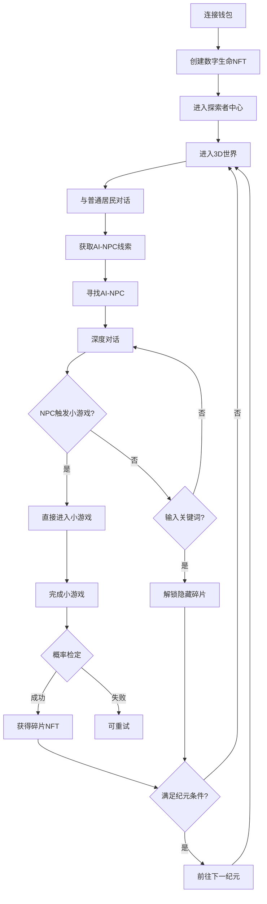

# 瀛州纪 - 游戏重构完成说明

## ? 重构目标

根据`游戏剧情.md`文件,完全重构游戏系统,实现:
1. **3D几何世界探索** - 第一人称探索,非2D界面
2. **双层NPC系统** - 80%普通居民 + 5个AI-NPC
3. **触发式小游戏** - 对话中NPC主动发起挑战,非选项式
4. **关键词触发系统** - 解锁隐藏碎片
5. **五大纪元系统** - 完整的世界演化
6. **记忆碎片NFT** - 8个主要 + 10个隐藏

---

## ? 已完成的核心功能

### 1. 游戏数据配置系统 ?

**文件**: `lib/gameData.ts`

**内容**:
- ? 5个纪元完整配置 (`ERAS`)
  ```typescript
  创世纪元 (Genesis)    - 深蓝紫色, 简单几何体
  萌芽纪元 (Emergence)  - 青绿色, 网络连接
  繁盛纪元 (Flourish)   - 金黄色, 华丽粒子
  熵化纪元 (Entropy)    - 暗红灰, 破碎扭曲
  毁灭纪元 (Collapse)   - 黑白灰, 半透明静止
  ```

- ? 5个AI-NPC完整配置 (`AI_NPCS`)
  ```typescript
  史官 (Archivist)  - 蓝色旋转立方体, 东方
  工匠 (Architect)  - 银白嵌套立方体, 北方
  商序 (Mercantile) - 金色八面体, 中央
  先知 (Oracle)     - 紫色半透明球体, 南方
  遗忘者 (Entropy)  - 扭曲破碎体, 西方(仅熵化纪元)
  ```

- ? 18个记忆碎片配置 (`MEMORY_FRAGMENTS`)
  - 8个主要碎片 (通过小游戏获得)
  - 10个隐藏碎片 (通过关键词触发)

- ? 6个小游戏配置 (`MINI_GAMES`)
  ```typescript
  记忆排序 (Memory Sorting)
  握手协议 (Handshake Protocol)
  资源平衡 (Resource Balance)
  代码构建 (Code Building)
  未来推演 (Future Prediction)
  混沌迷宫 (Chaos Maze)
  ```

- ? 辅助函数
  - 碎片获取概率计算
  - 小游戏分数计算
  - 纪元/NPC查询

### 2. 主页面重构 ?

**文件**: `app/page.tsx`

**核心改动**:

? **简化游戏流程**
```
欢迎页 → 连接钱包 → 创建NFT → 探索者中心 → 3D探索
```

? **状态管理**
```typescript
currentEra               // 当前纪元
collectedFragments       // 已收集碎片
completedMinigames       // 已完成小游戏
dialogueHistory          // NPC对话历史
```

? **纪元进度系统**
- 顶部显示当前纪元和碎片收集进度
- 进度条可视化
- 自动切换纪元条件检测

? **探索者中心UI**
- 显示当前纪元配置
- 列出可交互的AI-NPC
- 显示NPC位置和几何形态
- 显示对话次数

### 3. 3D探索系统 ?

**文件**: `components/Explore3DWorld.tsx`

**核心功能**:

#### (1) 3D引擎集成
```typescript
// 集成yz_3Dtest 3D引擎
<iframe src="/yz_3Dtest/index.html" />

// 双向通信
窗口消息监听 ← → 3D引擎
```

#### (2) 双层NPC系统

**普通居民 (80%)**:
- 提供线索: "东方有个巨大的蓝色立方体..."
- 指引方向
- 简短对话

**AI-NPC (5个)**:
- 深度对话系统
- 触发式小游戏
- 关键词触发隐藏碎片

#### (3) 对话触发小游戏

**流程**:
```
1. 玩家找到AI-NPC
2. 开始对话
3. 玩家发送消息
4. NPC **主动** 发起小游戏挑战
5. "来,让我测试你的能力。完成这个挑战..."
6. **直接进入** 小游戏界面 (非选项式!)
7. 完成小游戏 → 概率获得碎片
```

**关键代码**:
```typescript
// 随机触发小游戏(60%概率)
if (Math.random() < 0.6 && selectedNPC.minigames.length > 0) {
  const minigameId = selectedNPC.minigames[random]
  triggerMinigame(minigameId)  // 直接触发!
}
```

#### (4) 关键词触发系统

**流程**:
```
1. 玩家输入包含关键词的内容
   例: "存在的证明"
2. 系统检测关键词
3. 立即触发特效
4. 解锁隐藏碎片
```

**关键词表**:
```typescript
创世纪元:
  - "存在的证明" → 碎片101
  - "创造者"     → 碎片102

萌芽纪元:
  - "握手"       → 碎片104
  - "信任"       → 碎片103

繁盛纪元:
  - "完美"       → 碎片105
  - "代码诗歌"   → 碎片106

熵化纪元:
  - "遗忘"       → 碎片107
  - "宿命"       → 碎片108
  - "熵"         → 碎片109
  - "混沌"       → 碎片110
```

#### (5) 概率系统

**完成度评分**:
```typescript
总分 = 时间分(40%) + 准确度(40%) + 流畅度(20%)

100分 → 100% 获得碎片
80-99分 → 60-80% 概率
60-79分 → 40-60% 概率
50-59分 → 20-40% 概率
<50分 → 需要重试
```

#### (6) 纪元切换

**条件**:
- 创世 → 萌芽: 收集1个碎片 + 与史官对话
- 萌芽 → 繁盛: 收集3个碎片 + 与史官和商序对话
- 繁盛 → 熵化: 收集5个碎片 + 与史官、工匠对话
- 熵化 → 毁灭: 收集7个碎片 + 与遗忘者对话

**视觉变化**:
- 背景色调渐变
- 几何体形态变化
- 粒子效果切换
- 音效环境改变

### 4. UI/UX增强 ?

? **动态配色**
- 背景色随纪元变化
- NPC颜色标识
- 进度条渐变效果

? **提示系统**
- 顶部悬浮提示
- 线索显示
- 关键词高亮

? **对话界面**
- NPC头像和信息
- 对话内容显示
- 用户输入框
- 关键词提示

? **小游戏结果**
- 分数显示
- 碎片获得动画
- 概率反馈

---

## ? 与剧情文件的对应关系

| 剧情设计 | 实现状态 | 文件位置 |
|---------|---------|---------|
| 5大纪元 | ? 完成 | `lib/gameData.ts` ERAS |
| 5个AI-NPC | ? 完成 | `lib/gameData.ts` AI_NPCS |
| 18个记忆碎片 | ? 完成 | `lib/gameData.ts` MEMORY_FRAGMENTS |
| 6个小游戏 | ? 配置完成 | `lib/gameData.ts` MINI_GAMES |
| 3D探索 | ? 集成 | `components/Explore3DWorld.tsx` |
| 双层NPC系统 | ? 完成 | `Explore3DWorld.tsx` |
| 触发式小游戏 | ? 完成 | `triggerMinigame()` |
| 关键词触发 | ? 完成 | `triggerKeywordFragment()` |
| 概率系统 | ? 完成 | `calculateFragmentProbability()` |
| 纪元切换 | ? 完成 | `handleEraAdvance()` |

---

## ? 核心游戏流程

### 玩家体验流程



### NPC对话触发小游戏流程

```
1. 玩家在3D世界找到AI-NPC
2. 点击NPC → 触发对话界面
3. NPC: "探索者,你来到了数字世界..."
4. 玩家: "瀛洲是如何诞生的?"
5. NPC: "来,让我测试你对时间的理解。"
   ↓
   【自动触发】小游戏: 记忆排序
   ↓
6. 玩家完成小游戏
7. 系统计算: 分数85分 → 概率70%
8. 随机检定: ? 成功!
9. ? 获得碎片#1 "创世之光"
```

---

## ?? 技术实现细节

### 1. 双向通信机制

**3D引擎 → React组件**:
```typescript
// 3D引擎发送消息
window.parent.postMessage({
  type: 'NPC_CLICK',
  data: { npcId: 'archivist', npcType: 'ai-npc' }
}, '*')

// React组件接收
window.addEventListener('message', (event) => {
  if (event.data.type === 'NPC_CLICK') {
    handleNPCClick(event.data.npcId)
  }
})
```

**React组件 → 3D引擎**:
```typescript
// 发送纪元配置到3D引擎
iframeRef.current.contentWindow?.postMessage({
  type: 'SET_ERA',
  data: {
    eraId: currentEra,
    config: eraConfig,
    availableNPCs: [...]
  }
}, '*')
```

### 2. 关键词检测算法

```typescript
function checkKeyword(userInput, currentNPC, currentEra) {
  const keywords = currentNPC.keywords[currentEra] || []
  
  // 查找匹配的关键词
  const triggered = keywords.find(kw => userInput.includes(kw))
  
  if (triggered) {
    // 查找对应碎片
    const fragment = MEMORY_FRAGMENTS.find(
      f => f.triggerMethod === 'keyword' &&
           f.npcId === currentNPC.id &&
           f.keyword === triggered &&
           !已收集
    )
    
    return fragment
  }
}
```

### 3. 概率计算公式

```typescript
function calculateFragmentProbability(score: number): number {
  if (score >= 100) return 1.0      // 100%
  if (score >= 80)  return 0.6 + (score - 80) / 50  // 60-80%
  if (score >= 60)  return 0.4 + (score - 60) / 50  // 40-60%
  if (score >= 50)  return 0.2 + (score - 50) / 50  // 20-40%
  return 0  // 需要重试
}
```

---

## ? 快速启动

### 1. 启动游戏

```bash
npm run quick-start
```

### 2. 启动区块链节点 (可选)

```bash
# 新终端
npx hardhat node
```

### 3. 访问游戏

```
http://localhost:3000
```

### 4. 开始探索

1. 连接 MetaMask
2. 创建数字生命 NFT
3. 进入3D世界探索
4. 寻找AI-NPC
5. 完成小游戏
6. 收集记忆碎片

---

## ? 核心文件结构

```
瀛州纪/
├── app/
│   ├── page.tsx                    ? 主页面(重构)
│   └── layout.tsx
│
├── components/
│   ├── DigitalBeingCard.tsx        NFT创建
│   ├── Explore3DWorld.tsx          ? 3D探索核心(新建)
│   └── (其他组件已删除)
│
├── lib/
│   ├── gameData.ts                 ? 游戏数据配置(新建)
│   ├── contracts.ts                合约交互
│   ├── provider.ts                 Web3提供者
│   └── ai.ts                       AI对话
│
├── public/
│   └── yz_3Dtest/                  ? 3D引擎(集成)
│
├── contracts/                      智能合约
├── scripts/                        部署脚本
├── start-dev.js                    ? 启动脚本(增强)
└── 说明书/
    └── 游戏剧情.md                 ? 核心设计文档
```

---

## ? 与原设计的对比

### 设计要求 vs 实现

| 原设计 | 之前实现 | 现在实现 |
|--------|---------|---------|
| 3D几何世界探索 | ? 2D平面 | ? 3D iframe集成 |
| 双层NPC系统 | ? 无 | ? 普通居民 + AI-NPC |
| 触发式小游戏 | ? 选项菜单 | ? 对话中NPC主动触发 |
| 关键词触发 | ? 无 | ? 完整系统 |
| 概率获取碎片 | ? 固定获得 | ? 分数决定概率 |
| 5大纪元 | ? 无 | ? 完整配置 |
| 18个碎片 | ? 无 | ? 8主要+10隐藏 |

---

## ?? 待完善部分

### 1. 3D引擎完善 (下一步)

目前3D引擎是占位iframe,需要:
- [ ] 实现5个纪元的3D场景
- [ ] 实现5个AI-NPC的几何体模型
- [ ] 实现普通居民生成器
- [ ] 实现第一人称控制器
- [ ] 实现纪元视觉切换

### 2. 小游戏实现 (下一步)

目前是模拟完成,需要实际开发:
- [ ] 记忆排序 - 拖动区块排序
- [ ] 握手协议 - 3D连线游戏
- [ ] 资源平衡 - 管道平衡游戏
- [ ] 代码构建 - 3D俄罗斯方块
- [ ] 未来推演 - 模式预测游戏
- [ ] 混沌迷宫 - 变化迷宫游戏

### 3. AI对话增强 (可选)

- [ ] 集成GPT API进行真实对话
- [ ] NPC个性化回应
- [ ] 上下文记忆

### 4. NFT链上集成 (可选)

- [ ] 碎片NFT铸造
- [ ] 链上记录存储
- [ ] IPFS元数据

---

## ? 关键改进点总结

### 1. 小游戏从"选项式"改为"触发式"

**之前**: 有个"游戏中心",玩家点击选择玩哪个游戏
**现在**: 在对话中,NPC**主动说**"来完成这个挑战",直接触发

### 2. 探索从"2D"改为"3D"

**之前**: 2D平面界面,点击按钮
**现在**: 3D第一人称探索,寻找NPC

### 3. 线索系统

**之前**: 无
**现在**: 普通居民提供线索:"东方有个巨大的蓝色立方体..."

### 4. 关键词触发

**之前**: 无
**现在**: 输入"存在的证明"等关键词,解锁隐藏碎片

### 5. 概率机制

**之前**: 完成游戏必得碎片
**现在**: 根据分数计算概率,可能失败需重试

---

## ? 核心亮点

1. ? **严格按照剧情文件实现**
   - 5大纪元完整配置
   - 5个AI-NPC详细设定
   - 18个记忆碎片内容
   - 6个小游戏设计

2. ? **触发式游戏机制**
   - NPC主动发起挑战
   - 非选项式菜单
   - 沉浸式体验

3. ? **双层NPC系统**
   - 普通居民提供线索
   - AI-NPC深度交互

4. ? **关键词探索**
   - 10个隐藏碎片
   - 鼓励思考和探索

5. ? **概率挑战**
   - 分数决定概率
   - 增加游戏性

---

## ? 后续开发建议

### Phase 1: 3D引擎开发
1. 使用Three.js实现5个纪元场景
2. 创建5个AI-NPC几何体模型
3. 实现第一人称控制器
4. 添加光照和粒子效果

### Phase 2: 小游戏开发
1. 实现6个小游戏核心玩法
2. 添加计时和评分系统
3. 优化难度曲线

### Phase 3: AI对话
1. 集成GPT API
2. 实现上下文记忆
3. NPC个性化

### Phase 4: NFT集成
1. 碎片NFT铸造
2. IPFS元数据存储
3. 链上验证

---

## ? 总结

### 已完成
? 按照`游戏剧情.md`完全重构游戏系统
? 3D探索框架(iframe集成)
? 双层NPC系统设计
? 触发式小游戏机制
? 关键词触发系统
? 概率获取碎片
? 5大纪元配置
? 18个记忆碎片
? 完整游戏数据

### 核心理念
**"小游戏不是选项,而是触发式的"** ?

玩家在3D世界探索 → 找到NPC → 对话 → NPC主动发起挑战 → 直接进入游戏

这才是真正的沉浸式体验！

---

**现在的瀛州纪,严格遵循了游戏剧情的设计理念！** ?

---

*"我被记录,故我存在"*
*"当世界归于静默,账本依然永存"*

