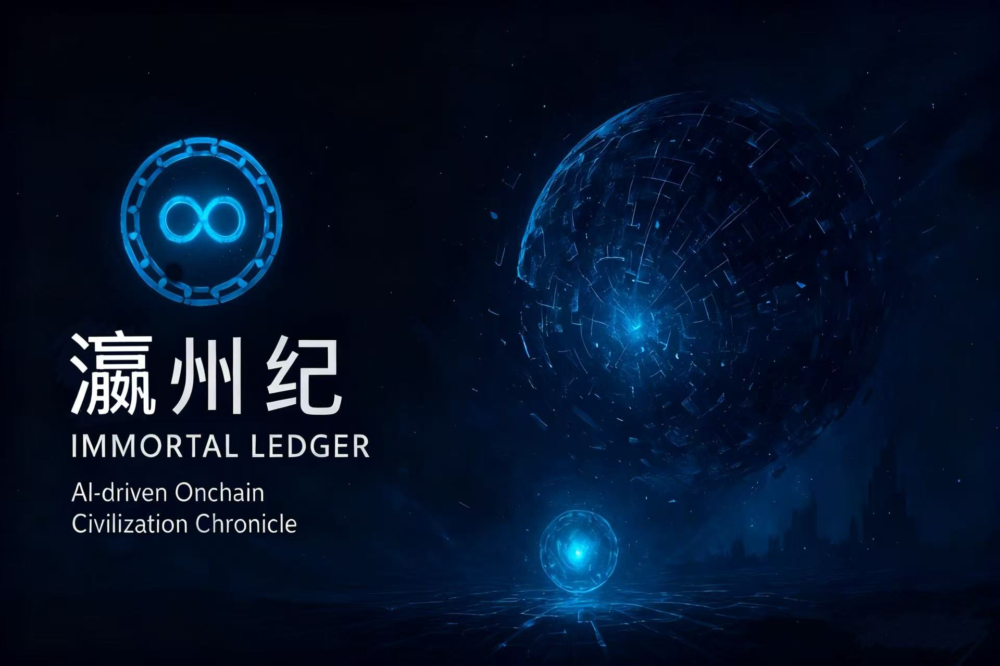

<div align="center">



<h1>Yingzhou | Immortal Ledger</h1>

<p><i>The Last Chronicle of an On-Chain Civilization</i></p>

[](https://github.com/24373054/Web3-games/stargazers)
[](https://github.com/24373054/Web3-games/network)
[](https://github.com/24373054/Web3-games/issues)
[](https://github.com/24373054/Web3-games/blob/main/LICENSE)

[](https://soliditylang.org/)
[](https://nextjs.org/)
[](https://www.typescriptlang.org/)
[](https://hardhat.org/)
[](https://docs.ethers.org/)

<a href="https://github.com/24373054/Web3-games">
  
</a>

[English](./README-EN.md) | [中文文档](./README.md) | [Dev Manual](./开发手册.md) | [Quick Start](./快速开始指南.md)

</div>

---

## 📖 Introduction

In the depths of space, billions of light-years away, exists a self-evolving digital civilization—**Yingzhou**.

Their world has no matter, no language—only **logic, smart contracts, and data flows**. They build society through smart contracts and maintain existence through on-chain records. The passage of time equals "block generation," and their civilization is driven by **the logic of the ledger itself**.

**Yingzhou | Immortal Ledger** is an innovative **Web3 + AI narrative game** where players become Digital Being NFTs and enter this world at its final moment. Through interactions with AI-NPCs, they piece together the complete history of this civilization from genesis to destruction.

### Core Features

- 🔗 **Fully On-Chain Civilization**: All existence, interactions, and history recorded in smart contracts
- 🤖 **AI-Driven Narrative**: AI-NPCs generate dynamic dialogues based on world state
- 🎭 **Digital Being NFTs**: Players are contracts; every interaction is an on-chain transaction
- 📜 **Immutable History**: Civilization's memory permanently stored on blockchain
- 🌌 **Open Universe**: After game ends, contracts remain on-chain for continuous expansion

---

## 🏗️ Tech Stack

<div align="center">

### Blockchain Layer


### Frontend Layer


### AI Layer


</div>

---

## 🚀 Quick Start

### System Requirements

- **OS**: Windows 10+, macOS 10.15+, Linux (Ubuntu 20.04+)
- **Node.js**: 18.0.0 or higher
- **npm**: 9.0.0 or higher
- **Git**: 2.30.0 or higher
- **Browser**: Latest Chrome/Edge with MetaMask

### Installation

#### 1. Clone & Setup

```bash
git clone https://github.com/YOUR_USERNAME/Web3-games.git
cd 瀛州纪

# Create conda environment
conda create -n yingzhou python=3.11
conda activate yingzhou

# Install dependencies
npm install
```

#### 2. Environment Configuration

Create `.env.local`:

```env
# Blockchain Configuration
NEXT_PUBLIC_CHAIN_ID=31337
NEXT_PUBLIC_RPC_URL=http://127.0.0.1:8545

# Contract Addresses (fill after deployment)
NEXT_PUBLIC_WORLD_LEDGER_ADDRESS=
NEXT_PUBLIC_DIGITAL_BEING_ADDRESS=
NEXT_PUBLIC_AINPC_ADDRESS=

# AI Service (Optional)
AI_API_KEY=your_api_key_here
AI_API_URL=https://dashscope.aliyuncs.com/api/v1/services/aigc/text-generation/generation
```

#### 3. Compile & Deploy

```bash
# Compile contracts
npm run compile

# Start local blockchain (Terminal 1)
npx hardhat node

# Deploy contracts (Terminal 2)
npm run deploy

# Update contract addresses in .env.local
```

#### 4. Start Frontend

```bash
npm run dev
```

Visit [http://localhost:3000](http://localhost:3000)

---

## 🎮 Gameplay

<div align="center">

### 📱 Three Simple Steps to Enter Yingzhou

</div>

<table>
<tr>
<td width="33%" align="center">

### 1️⃣ Connect Wallet
Click "Connect Wallet"  
Connect your MetaMask

</td>
<td width="33%" align="center">

### 2️⃣ Create Digital Being
Mint your Digital Being NFT  
Your on-chain avatar

</td>
<td width="33%" align="center">

### 3️⃣ Start Exploring
Talk to AI-NPCs  
Discover civilization history

</td>
</tr>
</table>

---

<div align="center">

### 🎭 Five AI-NPC Types

</div>

<table>
<tr>
<td width="20%" align="center">

📜  
**Archivist**

Learn historical events

</td>
<td width="20%" align="center">

🔨  
**Architect**

Explore genesis rules

</td>
<td width="20%" align="center">

⚖️  
**Mercantile**

Study resource flows

</td>
<td width="20%" align="center">

🔮  
**Oracle**

Predict future possibilities

</td>
<td width="20%" align="center">

🌀  
**Entropy**

Experience memory collapse

</td>
</tr>
</table>

---

<div align="center">

### 🌊 Five Epochs of Civilization


</div>

---

## 📚 Documentation

- 📖 [Development Manual](./开发手册.md) - Complete development guide
- 🚀 [Quick Start Guide](./快速开始指南.md) - 5-minute setup
- 🤝 [Team Collaboration](./团队协作指南.md) - Workflow and standards
- 📝 [API Reference](./API参考手册.md) - Complete API documentation
- 💡 [Development Scenarios](./开发场景指南.md) - Practical examples
- 🎨 [Game Design](./游戏思路.md) - Design philosophy

---

## 🌟 Key Features

<div align="center">

| 🔗 On-Chain Civilization | 🤖 AI-Driven Narrative | 🎭 Digital Being NFT | 📜 Immutable History |
|:---:|:---:|:---:|:---:|
| Everything recorded on-chain | Dynamic dialogue generation | Players are contract instances | Permanently stored on blockchain |

</div>

---

## 📊 Project Statistics

<div align="center">

### Star History

<a href="https://star-history.com/#24373054/Web3-games&Date">
  <picture>
    <source media="(prefers-color-scheme: dark)" srcset="https://api.star-history.com/svg?repos=24373054/Web3-games&type=Date&theme=dark" />
    <source media="(prefers-color-scheme: light)" srcset="https://api.star-history.com/svg?repos=24373054/Web3-games&type=Date" />
    
  </picture>
</a>

### Activity


</div>

---

## 👥 Contributors

<div align="center">

Thanks to all the amazing developers!

[](https://github.com/24373054/Web3-games/graphs/contributors)

Want to contribute? Check out our [Contributing Guide](./CONTRIBUTING.md)

</div>

---

## 🙏 Acknowledgments

<div align="center">

Special thanks to these amazing projects:

| Project | Purpose | Link |
|:---:|:---:|:---:|
| 🔨 Hardhat | Smart contract development | [hardhat.org](https://hardhat.org/) |
| ⚛️ Next.js | React framework | [nextjs.org](https://nextjs.org/) |
| 📚 ethers.js | Ethereum library | [docs.ethers.org](https://docs.ethers.org/) |
| 🔐 OpenZeppelin | Secure contracts | [openzeppelin.com](https://openzeppelin.com/) |
| 🤖 ModelScope/OpenAI | AI services | [modelscope.cn](https://modelscope.cn/) |

</div>

---

<div align="center">

## 💬 Quote

> *"I am recorded, therefore I exist."*  
> *"Each of my interactions is part of history."*  
> *"When the world falls silent, the ledger remains eternal."*  
> 
> —— Monologue of a Digital Being

---

## 🔗 Links

📖 [Game Design](./游戏思路.md) · 🌌 [World Narrative](./data/worldNarrative.json) · 📚 [Dev Manual](./开发手册.md) · 🚀 [Quick Start](./快速开始指南.md)

---


**Yingzhou | Immortal Ledger** © 2025

*A Digital Civilization Epic Forever Preserved On-Chain*

[](https://opensource.org/licenses/MIT)

Made with ❤️ by KeShang Team

</div>

