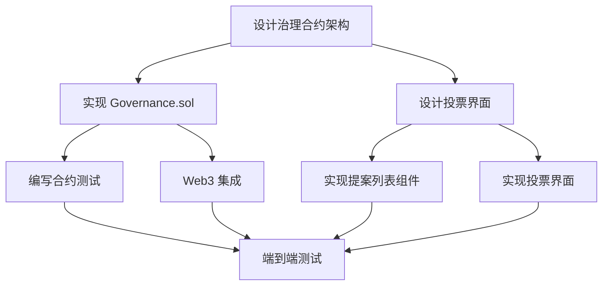

# 《瀛州纪》团队协作指南

> 团队高效协作的实用指南

---

## 📋 团队组织结构

### 团队角色

```
项目负责人 (Project Lead)
    │
    ├── 技术负责人 (Tech Lead)
    │   ├── 智能合约开发者 (1-2人)
    │   ├── 前端开发者 (1-2人)
    │   └── AI工程师 (1人)
    │
    ├── 产品负责人 (Product Owner)
    │   └── UI/UX设计师 (1人)
    │
    └── 测试/DevOps (1人)
```

### 职责矩阵

| 角色 | 主要职责 | 次要职责 | 工作目录 |
|------|---------|---------|----------|
| **技术负责人** | 架构设计、代码审查、技术决策 | 协调开发、解决技术难题 | 全部 |
| **智能合约开发者** | Solidity开发、合约测试、Gas优化 | 安全审计、部署 | `contracts/`, `test/`, `scripts/` |
| **前端开发者** | React组件、Web3集成、UI实现 | 用户体验优化 | `app/`, `components/`, `lib/` |
| **AI工程师** | AI集成、提示词优化、效果调优 | 数据处理 | `lib/ai.ts`, `app/api/`, `data/` |
| **UI/UX设计师** | 界面设计、用户体验、视觉效果 | 文档美化 | `app/globals.css`, 设计稿 |
| **测试/DevOps** | 测试编写、CI/CD、部署 | 监控、问题排查 | `test/`, 部署脚本 |

---

## 🗓️ 工作流程

### 每日站会（Daily Standup）

**时间**: 每天上午 10:00  
**时长**: 15 分钟  
**形式**: 视频会议或文字汇报

**模板**:
```
姓名：张三
角色：前端开发者

✅ 昨天完成：
- 实现了 DialogueInterface 组件
- 修复了钱包连接的 bug

🚀 今天计划：
- 优化 EventTimeline 的性能
- 添加加载动画

⚠️ 遇到的问题：
- Web3 provider 切换时状态丢失，需要技术讨论

🆘 需要帮助：
- 需要 AI 工程师协助测试对话接口
```

### 周会（Weekly Meeting）

**时间**: 每周一上午 10:00  
**时长**: 1 小时

**议程**:
1. **上周回顾** (15分钟)
   - 完成的任务
   - 遇到的问题
   - 经验总结

2. **本周规划** (20分钟)
   - 任务分配
   - 优先级排序
   - 依赖关系确认

3. **技术讨论** (20分钟)
   - 架构问题
   - 技术方案
   - 最佳实践

4. **其他事项** (5分钟)
   - 工具改进
   - 流程优化
   - 团队建设

### 冲刺计划（Sprint Planning）

**周期**: 2周一个冲刺  
**时间**: 每两周一上午 10:00  
**时长**: 2 小时

**流程**:
1. **产品目标确定** - 确定本冲刺要实现的功能
2. **任务拆分** - 将功能拆分为具体任务
3. **工作量估算** - 估算每个任务的工作量（故事点）
4. **任务认领** - 团队成员认领任务
5. **风险识别** - 识别可能的风险和依赖

---

## 📊 任务管理

### 使用 GitHub Projects

#### 看板列

```
📥 待办 (Backlog)
    ↓
🎯 本周计划 (This Week)
    ↓
🚧 进行中 (In Progress)
    ↓
👀 代码审查 (Review)
    ↓
✅ 完成 (Done)
```

#### 任务卡片模板

```markdown
## 功能：添加 DAO 治理投票

**类型**: Feature  
**优先级**: High  
**工作量**: 8 故事点  
**负责人**: @张三  
**依赖**: #123 WorldLedger 状态管理优化

### 需求描述
实现 DAO 治理投票功能，允许数字生命持有者对世界事件进行投票。

### 验收标准
- [ ] 创建 Governance.sol 合约
- [ ] 实现提案创建功能
- [ ] 实现投票功能
- [ ] 添加前端投票界面
- [ ] 编写单元测试（覆盖率 > 80%）
- [ ] 更新文档

### 技术方案
使用 OpenZeppelin Governor 合约作为基础...

### 相关资源
- [设计稿](link)
- [技术文档](link)
```

### 任务优先级

| 优先级 | 标签 | 处理时间 | 说明 |
|--------|------|----------|------|
| 🔴 紧急 | `priority: critical` | 立即处理 | 影响核心功能的严重bug |
| 🟠 高 | `priority: high` | 当天处理 | 重要功能或显著bug |
| 🟡 中 | `priority: medium` | 本周处理 | 常规功能开发 |
| 🟢 低 | `priority: low` | 有空再做 | 优化和改进 |

### 任务标签系统

```
类型标签:
- feature: 新功能
- bug: Bug修复
- refactor: 重构
- docs: 文档
- test: 测试
- chore: 杂项

技术标签:
- contract: 智能合约
- frontend: 前端
- ai: AI相关
- design: 设计

状态标签:
- blocked: 被阻塞
- in-review: 审查中
- need-help: 需要帮助
```

---

## 💬 沟通规范

### 沟通渠道

| 场景 | 渠道 | 响应时间 |
|------|------|----------|
| 紧急问题 | 电话/语音通话 | 立即 |
| 重要讨论 | 视频会议 | 当天 |
| 日常沟通 | Discord/Slack | 2小时内 |
| 代码讨论 | GitHub PR 评论 | 1天内 |
| 异步信息 | 项目文档 | - |

### Discord 频道结构

```
📁 《瀛州纪》开发团队
  ├── 📢 公告 (#announcements)
  ├── 💬 日常闲聊 (#general)
  ├── 👨‍💻 开发讨论
  │   ├── #frontend
  │   ├── #smart-contracts
  │   └── #ai-integration
  ├── 🐛 问题反馈 (#issues)
  ├── 📚 资源分享 (#resources)
  └── 🎉 成就展示 (#achievements)
```

### 提问的智慧

#### ✅ 好的提问

```
问题：合约部署时出现 "nonce too high" 错误

环境：
- Hardhat 本地网络
- Node.js v18.17.0
- Windows 11

复现步骤：
1. 启动 hardhat node
2. 运行 npm run deploy
3. 出现错误

错误信息：
```
Error: nonce has already been used
    at ...
```

已尝试的解决方案：
- 重启 hardhat node ❌
- 清除 cache ❌

需要帮助确认是否是 MetaMask 缓存问题。
```

#### ❌ 不好的提问

```
问题：部署失败了

怎么办？？？
```

---

## 🔄 代码协作

### Pull Request 流程

#### 1. 创建 PR

```markdown
## 功能描述
添加 DAO 治理投票功能

## 改动内容
- 新增 Governance.sol 合约
- 添加投票界面组件
- 更新相关文档

## 测试情况
- [x] 单元测试通过
- [x] 集成测试通过
- [x] 手动测试完成

## 截图/演示
[添加界面截图或演示视频]

## 检查清单
- [x] 代码符合规范
- [x] 添加了必要的注释
- [x] 更新了文档
- [x] 测试覆盖率 > 80%
- [x] 无 lint 错误

## 相关 Issue
Closes #123

---
请 @技术负责人 审查
```

#### 2. 代码审查清单

**审查者需要检查**:

- [ ] **功能实现**
  - 是否满足需求
  - 边界情况是否处理
  - 错误处理是否完善

- [ ] **代码质量**
  - 命名是否清晰
  - 逻辑是否简洁
  - 是否有重复代码
  - 注释是否充分

- [ ] **安全性**（合约）
  - 是否有重入风险
  - 权限控制是否正确
  - 输入验证是否充分

- [ ] **性能**
  - Gas 消耗是否合理
  - 是否有性能瓶颈
  - 数据库查询是否优化

- [ ] **测试**
  - 测试是否充分
  - 测试是否通过
  - 覆盖率是否达标

#### 3. 审查评论示例

**✅ 建设性的评论**:

```markdown
这里使用 `memory` 而不是 `storage` 会更节省 Gas：

​```solidity
// 建议修改
function processData(uint256[] memory data) public {
    // ...
}
​```

参考：[Solidity Gas 优化最佳实践](link)
```

**❌ 不建设性的评论**:

```markdown
这代码写得不行
```

#### 4. 合并要求

PR 合并前必须满足：
- [ ] 至少 1 人审查通过（复杂功能需 2 人）
- [ ] 所有 CI 检查通过
- [ ] 没有未解决的讨论
- [ ] 代码冲突已解决

---

## 🎯 任务分配示例

### 功能开发：DAO 治理系统

#### 任务分解

**Epic**: DAO 治理系统 (40 故事点)

1. **合约开发** (16 故事点)
   - `[ ]` 设计治理合约架构 (3点) - @合约开发者A
   - `[ ]` 实现 Governance.sol (8点) - @合约开发者A
   - `[ ]` 编写合约测试 (5点) - @合约开发者B

2. **前端开发** (16 故事点)
   - `[ ]` 设计投票界面 (3点) - @设计师
   - `[ ]` 实现提案列表组件 (5点) - @前端开发者A
   - `[ ]` 实现投票界面 (5点) - @前端开发者B
   - `[ ]` Web3 集成 (3点) - @前端开发者A

3. **集成测试** (5 故事点)
   - `[ ]` 端到端测试 (3点) - @测试工程师
   - `[ ]` 性能测试 (2点) - @测试工程师

4. **文档** (3 故事点)
   - `[ ]` API 文档 (1点) - @合约开发者A
   - `[ ]` 用户指南 (2点) - @产品负责人

#### 依赖关系



#### 时间线（2周冲刺）

```
Week 1:
周一    - 设计治理合约架构
        - 设计投票界面
周二    - 实现 Governance.sol (进行中)
周三    - 实现 Governance.sol (进行中)
        - 实现提案列表组件 (开始)
周四    - 实现 Governance.sol (完成)
        - 实现提案列表组件 (进行中)
        - 实现投票界面 (开始)
周五    - 编写合约测试 (开始)
        - 实现提案列表组件 (完成)
        - 实现投票界面 (进行中)

Week 2:
周一    - 编写合约测试 (进行中)
        - 实现投票界面 (完成)
        - Web3 集成 (开始)
周二    - 编写合约测试 (完成)
        - Web3 集成 (进行中)
周三    - Web3 集成 (完成)
        - 端到端测试 (开始)
周四    - 端到端测试 (进行中)
        - 文档编写 (开始)
周五    - 端到端测试 (完成)
        - 文档编写 (完成)
        - 演示准备
```

---

## 📝 文档协作

### 文档类型

| 文档类型 | 负责人 | 更新频率 | 位置 |
|---------|--------|----------|------|
| 开发手册 | 技术负责人 | 新功能时 | `开发手册.md` |
| API文档 | 开发者 | 代码变更时 | `docs/api/` |
| 用户指南 | 产品负责人 | 功能发布时 | `docs/guides/` |
| 部署文档 | DevOps | 部署流程变更时 | `DEPLOYMENT.md` |
| 项目规划 | 项目负责人 | 每月 | `docs/planning/` |

### 文档写作规范

#### Markdown 样式指南

```markdown
# 一级标题 - 文档标题

简短的引言段落。

## 二级标题 - 主要章节

### 三级标题 - 子章节

正文内容使用普通段落。

**重点内容**使用粗体。

`代码片段`使用行内代码。

​```typescript
// 代码块使用语法高亮
function example() {
  return "示例";
}
​```

> 引用或提示信息

- 无序列表项 1
- 无序列表项 2

1. 有序列表项 1
2. 有序列表项 2

| 表头1 | 表头2 |
|------|------|
| 内容1 | 内容2 |
```

#### 技术文档模板

```markdown
# 功能名称

## 概述
简要描述功能的目的和价值。

## 使用场景
列举 2-3 个典型使用场景。

## 快速开始
最简单的使用示例（5行代码以内）。

## 详细说明

### 参数说明
列出所有参数、类型、默认值。

### 返回值
说明返回值类型和含义。

### 示例
提供 2-3 个实际示例。

## 注意事项
列出使用时需要注意的问题。

## 常见问题
Q&A 形式的常见问题解答。

## 相关资源
- 链接到相关文档
- 参考资料
```

---

## 🏆 最佳实践

### 高效协作习惯

1. **主动沟通**
   - 遇到问题及时提出
   - 完成任务主动通知
   - 需要帮助明确说明

2. **及时更新**
   - 每天更新任务状态
   - PR 及时响应审查意见
   - 文档随代码同步更新

3. **知识共享**
   - 分享有用的工具和资源
   - 记录踩过的坑和解决方案
   - 主动帮助新成员

4. **持续改进**
   - 定期回顾流程效率
   - 提出改进建议
   - 学习新技术和最佳实践

### 代码审查最佳实践

**作为提交者**:
- 保持 PR 小而聚焦（< 500行）
- 提供清晰的描述和上下文
- 自己先审查一遍代码
- 及时响应审查意见

**作为审查者**:
- 24小时内给出反馈
- 提出建设性意见，不要只是批评
- 解释"为什么"，不只是"怎么做"
- 认可好的代码实践

### 时间管理

**番茄工作法**:
- 25分钟专注工作
- 5分钟休息
- 4个番茄后长休息15分钟

**每日计划**:
```
上午：
- 09:00-09:30  查看消息和邮件
- 09:30-10:00  日站会
- 10:00-12:00  深度工作（重要任务）

下午：
- 14:00-16:00  开发工作
- 16:00-17:00  代码审查、沟通协调
- 17:00-17:30  整理和规划明天
```

---

## 🎊 团队文化

### 价值观

1. **卓越** - 追求高质量的代码和产品
2. **协作** - 团队成功高于个人成就
3. **创新** - 勇于尝试新技术和方法
4. **责任** - 对自己的工作负责
5. **成长** - 持续学习和进步

### 庆祝成就

- 📝 每周五分享"本周成就"
- 🎉 里程碑达成时团队庆祝
- 🏆 月度"最佳贡献者"表彰
- 🌟 在 Discord 展示优秀工作

### 团队建设

- 每月一次线上游戏活动
- 每季度一次技术分享会
- 项目完成后的庆功会
- 不定期的知识分享

---

## 📞 冲突解决

### 技术分歧

1. **讨论** - 各方阐述观点和理由
2. **调研** - 收集资料和案例
3. **实验** - 小范围试验对比
4. **决策** - 技术负责人最终决定
5. **记录** - 记录决策和原因

### 任务冲突

1. **明确优先级** - 由产品负责人确定
2. **调整资源** - 必要时重新分配
3. **及时沟通** - 不要让问题积累
4. **寻求帮助** - 向项目负责人求助

---

## 📚 资源

### 团队工具

- **代码管理**: GitHub
- **项目管理**: GitHub Projects
- **沟通**: Discord / 飞书
- **文档**: GitHub Wiki / Notion
- **设计**: Figma
- **时间追踪**: Toggl (可选)

### 学习资源

- [团队协作最佳实践](https://example.com)
- [敏捷开发指南](https://example.com)
- [代码审查规范](https://example.com)

---

## ✅ 入职检查清单

**新成员加入团队时需要完成**:

### 第一天
- [ ] 加入 Discord 频道
- [ ] 获取 GitHub 仓库访问权限
- [ ] 阅读开发手册
- [ ] 配置开发环境
- [ ] 运行项目（本地）

### 第一周
- [ ] 完成一个小任务（如修改文档）
- [ ] 参加日站会
- [ ] 参加周会
- [ ] 认识团队成员
- [ ] 了解项目路线图

### 第一月
- [ ] 独立完成一个功能
- [ ] 审查他人代码
- [ ] 分享学习心得
- [ ] 提出改进建议

---

**让我们一起打造《瀛州纪》！** 🚀

---

*最后更新：2025-10-26*  
*版本：1.0.0*

