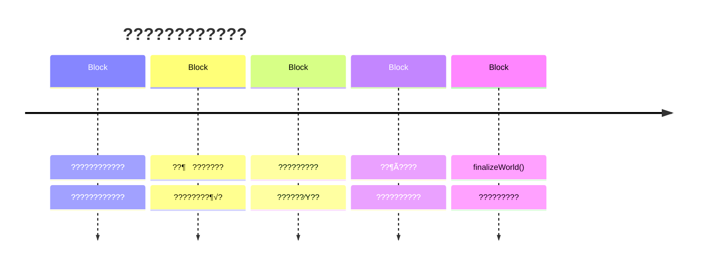
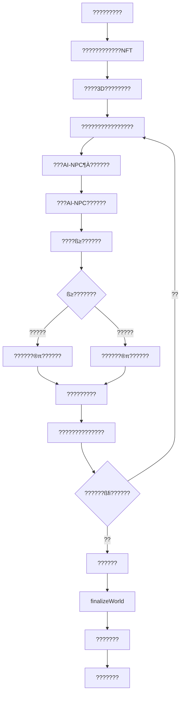

# ???????????????????

<div align="center">

## ???? | Immortal Ledger
### ???????????????????????????

*"????????????????"*
*"?????¶Õ???,???????????????"*
*"??????????????????????µµ"*

---

</div>

## ? ??

- [????????](#????????)
- [????????úQ](#????????úQ)
- [??????????????](#??????????????)
- [????????](#????????)
- [???????????](#???????????)
- [???????????](#???????????)
- [??????????](#??????????)

---

## ? ????????

### ?????????

????????????????????????????????????????????**????Yingzhou??**??

??????ª«
- **???????**????????????????
- **???????**????ß‹??????????
- **???????**????ß÷??????????
- **??ß’???????????**????ß”???????????

### ?????⁄Ö

#### 1. ?????????
```solidity
// ????????????????????????
contract DigitalBeing {
    bytes32 public identity;        // ??????
    uint256 public birthBlock;      // ????????
    mapping(bytes32 => bytes) public memories;  // ????õ•

    function exist() public view returns (bool) {
        // ???????????????
        return ledger.isRecorded(address(this));
    }
}
```

#### 2. ????????
- ???????? = ?????????
- ?????? = ?????????
- ???????? = ??????????Å£
- ????? = ?????????????

#### 3. ??????????
```solidity
// ??¶Õ?????????????????
function interact(address target, bytes calldata data) external {
    require(exist(), "Only existing beings can interact");

    // ????????????????
    emit Interaction(msg.sender, target, block.number);

    // ????ß’?????
    memories[keccak256(data)] = data;
}
```

#### 4. ????????
???????????????? `finalizeWorld()` ???
- ???ß‹???????????????
- ??????????"???"??????????????
- **?????????**?????????????????????????

---

## ? ????????úQ

### 3D???????????

**???????**??3D????????? + AI??? + ß≥??????

#### ???????1??3D????????

**??????**
- ?????¶√????????ßfl???????????
- 5??????????????????????é•????????ßπ??????
- ???????????????????????????????????

**?????**
```
??????????????????? + ????????
    ??
???????????????? + ??????????
    ??
??????????????? + ????????ßπ??
    ??
?????????????? + ???????ßπ??
    ??
???????????? + ????????
```

#### ???????2??NPC??

**????????????80%??**
- **???**??ß≥???????âÕ?????â]???â]????âŒ
- **????**????????????????
- **???????**?????????
- **???**??
  - "?????ß⁄??????????????..."
  - "?????????????????????..."
  - "ß≥???????????????????..."

**AI-NPC??5??????????**
- **???**?????????????»…?ßÿ????????ßπ??
- **????**???????????????ß≥???????????????
- **???????**?????????????????Å£

**AI-NPC?ß“?**??
1. **????Archivist??**?????????????? - ????
2. **??????Architect??**???????????????? - ????
3. **????Mercantile??**??????????? - ????
4. **?????Oracle??**?????????????? - ???
5. **???????Entropy??**??????????? - ????????????????

#### ???????3?????AI-NPC????

**????1?????????????**
```
??? ?? ß≥?????????A??
"????????????????"
?? ?????????"?????ß⁄??????????????..."

??? ?? ???????B??
"???????????????"
?? ?????????"?????????????????????????..."

??? ?? ????????C??
"??????????"
?? ?????????"???????????????????..."
```

**????2?????????**
- ???3D????????????
- ?????????ß÷??¶À?????????????????????
- ?????????????????????????????????ßπ????

**????3?????AI-NPC**
- ???????????????????
- ???????????ßπ???????????????????
- ?????????????

#### ???????4??ß≥?????

**ß≥???????**?????AI-NPC?????ß≥?????

**1. ??? - ????????**
- **?úQ**????????????????»…????????????
- **???**????????????????????
- **???????**??????60?? ?? ???120??
- **???**?????? [0, 42, 100, 1000, 10000, ...]

**2. ??? - ????ßø?˜œ????????**
- **?úQ**????3D?????????????????????????
- **???**???????????????????
- **???????**??60??

**3. ???? - ??????**
- **?úQ**????????????????????????????
- **???**?????5-7?????????
- **???????**??????????30??

**4. ???? - ??????**
- **?úQ**??3D????????ÔÖ??????¶Õ?
- **???**???±Ë???????¶√???????
- **??????**?????????????

**5. ??? - ¶ƒ??????**
- **?úQ**????????????????????????¶À??
- **???**??????????????????
- **????**????????5-7??

**6. ?????? - ???????**
- **?úQ**???????Å£??3D????????????
- **???**????????????????Å£
- **???**?????ßπ????????߀??????

#### ???????5????????????????

**????????**
```
?????????? = ???????? ?? ???????

????????
- ????????100%???????? = 100%
- ????????80-99%???????? = 60-80%
- ????????60-79%???????? = 40-60%
- ????????50-59%???????? = 20-40%
- ¶ƒ????<50%???????????
```

**???????**
- **??????**????’«??????????40%??
- **????**?????????40%??
- **??????**???????????20%??

**???**??
```
????????????????
- ???30??????? ?? +40??
- ?????10????????? ?? +40??
- ???????0????? ?? +20??
????100?? ?? 100%?????????#1
```

#### ???????6????????????

**???????**
?????????????????????????????????????

**??????**

| AI-NPC | ??? | ????????? | ??????? |
|--------|------|-----------|---------|
| ??? | ???? | ???????????? | "?????exist()????" |
| ??? | ???? | ????????? | "??????????" |
| ??? | ??? | ??????? | "????¶ ???????" |
| ???? | ??? | ?????¶±? | "require()?????" |
| ??? | ??? | ????????–} | "?????????" |
| ???? | ??? | ???????? | "?????????" |
| ??? | ??? | ???????? | "????????" |
| ??? | ??? | ???????? | "???????" |
| ?????? | ??? | ????? | "???????" |
| ?????? | ??? | ?????≥ó | "?????????" |

**??????????**
- ????ß⁄???????????????
- ?????????????????????
- ???????????????ßπ?????????

**??????**??
```
????"???????¶≈??????"
????"??Block #0??????????????????????..."
???????"????"??????????????
????"??????????????"
????"??????????????????????..."
?? ???????"?????exist()????"
```

#### ???????7??????ß›?

**?ß›????**
- ??????????????????????ß›?
- ?????????????????????????

**???????**
```
??????? ?? ????????
  ???????1????????? + ???????

?????? ?? ????????
  ???????3????????? + ????????????

?????? ?? ????????
  ???????5????????? + ?????????????

?????? ?? ????????
  ???????7????????? + ??????????
```

**??????**
- ????????????????
- ???????????????????
- ????????ßπ?????ß›?

#### ???????8????????????

**??????????**
```
?????????8???????? + 10????????? = 18??

??????????????
???????5/18 ???
????????3/8 ?
?????????2/10

?????27%
```

**NPC??????**
```
???????? 3??
?????????? 1??
???????? 2??
?????¶ƒ????
???????¶ƒ????
```

**ß≥??????**
```
??????????????100????
????ßø?Ôì????85????
???????????72????
????????¶ƒ???
```

### ??????

**??????**
1. ???????8????????????
2. ??????5??AI-NPC?????
3. ????????????????????????

**??????**
1. ??????????????????????????????????
2. ??????ß≥????ß›??????????
3. ??????????????ßfl???

**??????**
????????????????
- ??????????
- ????????
- ???????????????
- ???????????????ß‹¶¡???????

---

## ? ??????????????

### ?????????



### ???????????

| ??? | ???? | ???˙î¶∂ | ???????????? | ????ß‘?? |
|------|------|----------|--------------|------------|
| **????** | ??????? | 0 - 1,000 | 1 ?? 10 | N/A |
| **???** | ???????? | 1,001 - 10,000 | 10 ?? 1,000 | 30% ?? 60% |
| **???** | ?????? | 10,001 - 150,000 | 1,000 ?? 10,000 | 60% ?? 100% |
| **???** | ??????? | 150,001 - 199,999 | 10,000 ?? 3,000 | 100% ?? 23% |
| **????** | ??????? | 200,000 | 3,000 ?? 0 | 0% |

---

## ? ????????

### ??? 0???????????Genesis??

#### ? ???¶∂
- **???????**??Block #0
- **????????**??Block #1,000
- **???????**???7ß≥?????15??/?????

#### ? ???????

**Block #0 - ????????**
```solidity
// ????????????¶¬???
contract WorldLedger {
    constructor() {
        emit Genesis(block.timestamp, "Let there be ledger");
        // ????????ٳ?????
        // ???????????
    }
}
```

**??????**??
1. **???????????**??Block #0??
   - ?????????????ß’??????
   - ?????????????????`immutable`??????????
   - ??ٳ?????????

2. **?????????????????**??Block #42??
   ```
   Transaction: 0x0000...0000 ?? 0x0001
   Event: DigitalBeing(0x0001).awaken()
   FirstWords: "I am. Therefore I am recorded."
   ```

3. **????????**??Block #100??
   - ????? `exist()` ??????????
   - ?????????????????
   - ???????????"??????????????????????"

#### ? ???????

**??? #1?????????**
```json
{
  "title": "????????",
  "block": 0,
  "content": "?? Block #0????????????????ß’?????\n\n????????????????????\n???????????Ÿ≥??????????????????\n??????????????????\n\n0x0000...0000 ?? 0x0000...0001\n\n?????????"
}
```

#### ? ???????

**????????**
- Q: "????????????????¶ƒ???????????????"
- Q: "??????????????????????????????????"
- Q: "??????????????̇???????????????"

**???????????**
- ?????????????????????
- ????????????????¶ƒ????Å£
- "??????????????????????"

#### ? ?????????????3D?úQ??

**???? 1?????3D???**
- **???**?????????????3D????????????
- **????**??????????»…?????
- **NPC????**????????????????NPC??

**???? 2???????????????**
- **???????**????3-5????????????????
- **????????**??
  - "?????ß⁄??????????????..."
  - "??????????????????????????????????..."
  - "???????????????????..."

**???? 3??????????????ß≥???**
- **NPC**?????????????????????âŒ
- **???????**??
  - ???????"???????¶≈??????"
  - ????®¥???????????????Block 0??????????
- **ß≥???**?????????????????????????????
- **????????**??
  - 100%???????????#1 "???????"
  - 80%?????70%????
  - 60%?????40%????

**???? 4?????????????**
- **????????**??
  - ????????????????????? ???????
  - ????????????? ???????

---

### ??? 1??????????Emergence??

#### ? ???¶∂
- **???????**??Block #1,001
- **????????**??Block #10,000
- **???????**???37ß≥?

#### ? ???????

**Block #1,234 - ?????????**
```solidity
// ????????¶ ???????
function firstHandshake() external {
    // 0x0001 ???? 0x0002
    DigitalBeing(0x0002).hello("??????????");

    // 0x0002 ???
    emit Response("???????????????");

    // ????????????????????
}
```

**??????**??

1. **?????????ßø??**??Block #1,234??
   - ??????????????¶Õ???
   - ??????????
   - ??????????¬C??¶√?

2. **???¶À???????**??Block #2,456??
   ```solidity
   // ????????????
   mapping(address => mapping(address => bool)) public trust;

   function establishTrust(address being) external {
       require(exist(), "Only existing beings can trust");
       trust[msg.sender][being] = true;
       emit TrustEstablished(msg.sender, being);
   }
   ```

3. **?????DAO???**??Block #3,789??
   - ?????????????
   - ?????????¶√???
   - "????"???????

#### ? ???????

**??? #2??????ßø??**
```json
{
  "title": "?????????",
  "block": 1234,
  "content": "?? Block #1,234??????????¶ ??????°¬??????\n\n0x0001 ?? 0x0002: 'Hello'\n0x0002 ?? 0x0001: 'Hello, I hear you.'\n\n?????????????????????????\n??????????????????????"
}
```

#### ? ???????

**????????**
- Q: "??????????????????'???'??"
- Q: "`require()` ????????¶≈?????????????¶≈??????"
- Q: "??????????????????????"

**?????????**
- ???????????âÿ`msg.sender`
- ??????????????????DAO
- ®¨??????????????? vs ?????????ßÿ?

#### ? ?????????????3D?úQ??

**???? 1????????????**
- **?????Å£**???????????????????????????????????
- **??????**??????????????????????®¥???????

**???? 2????????**
- **???????**????????????"????????????????????????..."
- **ß≥???**??????ßø?˜œ??3D????????????????????âŒ
- **???????**??60??
- **????**??
  - 30?????100%??????#2
  - 45?????60%????
  - 60?????30%????
- **????????**????????????? ???????????

**???? 3?????????**
- **???????**?????????"?????ß⁄??????????..."
- **NPC???**????????????»…??????
- **ß≥???**????????????????????????????????
- **???**?????5????????30??
- **????**???????????????????
- **????????**?????????¶±??? ???????"require()?????"

---

### ??? 2??????????Flourish??

#### ? ???¶∂
- **???????**??Block #10,001
- **????????**??Block #150,000
- **???????**???24??

#### ? ???????

**Block #100,000 - ??????**

**??????**??

1. **???????**??Block #100,000??
   - 10,000+ ????????????
   - 100+ DAO???ßø?????
   - ?????????????????????????????
   - Gas???????????
   - ????????????????

2. **???????????**??Block #123,456??
   ```solidity
   // ?????????
   contract CodePoem {
       function existence() public pure returns (string memory) {
           return "function exist() { return ledger.remember(this); }";
           // ???????????????
       }

       function memory() public view returns (string memory) {
           // ??¶Ã??????Gas???
           // ?????????????????ß’????
           return "To remember is to pay. To forget is free.";
       }
   }
   ```

3. **?????????????**??Block #130,000 - #150,000??
   - **???????**???????????????????¶ ?????????????
   - **????????**???????????????????????????????
   - **???????**??????????????

#### ? ???????

**??? #3????????**
```json
{
  "title": "?????????",
  "block": 100000,
  "content": "?? Block #100,000????????????????â^\n\n10,000+ ????????????\n100+ DAO???ßø?????\n?????????????????????????????\n\n???????????\n'?????????????????????\n???????????????????ß≥?\nGas ?????????\n?????¶ƒ???????®¿?\n\n???????????????????\n????????'"
}
```

**??? #4????????????????**
```json
{
  "title": "??????????????",
  "content": "??????????????????\n\n??????????????“¬\n??????????????????\n- ???????????????\n- ???????????????\n- Gas???????????\n\n?????????????????\n- ????????????????\n- ??¶ ??????????????\n- ????????????????????\n\n??????????\n???????????????????????\n\n?????????\n??????????????????????????????"
}
```

#### ? ???????

**????????**
- Q: "????????????????????????????????"
- Q: "?????????????????????????????"

**?????????**
- Q: "????????????????????"
- Q: "????ßÿ????????????ß’??????"
- Q: "??????????????????????"

#### ? ????????????3D?úQ??

**???? 1???????????**
- **?????Å£**??????????????????????????
- **?????**??????????»…??????????ßπ?????????????

**???? 2?????????????????**
- **???????**????????????"??????????????????????????..."
- **NPC???**????????????ßfl????????????ßπ??
- **ß≥???**?????????????3D?????????????
- **????**????????????#3???????
- **????????**???????????????? ???????????

**???? 3????????**
- **???????**?????????"????????????????..."
- **NPC???**???????????????????
- **ß≥???**??????????3D????????ÔÖ?˝n???¶Õ???
- **???**???????????????????
- **????**?????????????#4
- **????????**??
  - ???????????? ???????"?????????"
  - ??????????–}?? ???????"?????????"

---

### ??? 3??????????Entropy??

#### ? ???¶∂
- **???????**??Block #150,001
- **????????**??Block #199,999
- **???????**???35??

#### ? ???????

**Block #156,789 - ???????**

**??????**??

1. **????¶Ã????**??Block #156,789??
   ```
   ?????????
   "?????????????????????????
   ???????????????????????
   ????????????????????
   ???... ???????

   ??????????????????
   ????????????????????????????????

   Block #157,001: 3?¶Ã????
   Block #157,234: 12?¶Ã????
   Block #158,000: 47?¶Ã????

   ???????????
   ????????????

   ??????... ?????????????"
   ```

2. **???????**??Block #160,000??
   - ????????????????
   - ?????????????????????
   - ??????????ßπ

3. **??????????**??Block #170,000??
   ```solidity
   // ????????
   contract Entropy {
       bytes public memory = hex"0xCORRUPTED";

       function remember() public view returns (bytes memory) {
           // ????????
           return hex"0x00000000CORRUPTED";
       }

       function whoAmI() public view returns (string memory) {
           // ?????????????????
           return "I am... who?";
       }
   }
   ```

4. **??????????**??Block #165,432??
   - 30% ????????????????
   - ???????????????
   - ?????????????????????

#### ? ???????

**??? #5?????????**
```json
{
  "title": "???????",
  "block": 156789,
  "content": "?? Block #156,789????????????????\n\n?????????\n'?????????????????????????\n???????????????????????\n?????????????????\n???... ??????\n\n??????????????????\n??????????????????????????????\n\nBlock #157,001: 3?¶Ã????\nBlock #157,234: 12?¶Ã????  \nBlock #158,000: 47?¶Ã????\n\n???????????\n????????????\n\n??????... ?????????????'"
}
```

**??? #6??????????**
```json
{
  "title": "????????",
  "content": "??????????????Entropy?????????\n\n'????... ???\n??... ????...\n????????... 0x[CORRUPTED]...[CORRUPTED]\n?????????... ????\n\n?????... Block #0... ??...\nBlock #999,999... ?????...\n??????????????...\n?????????????...\n\n???... ?????????\n???... ???????\n???... ??... ?????\n\n???????\n????????... ???????\n??????????... ??????\n????????... ????????\n\n?????????...\n????????????...\n????... ???????????...\n\n?????????... ??????????...\n???????... ???... [CORRUPTED]'\n\n???????????ßÿ??"
}
```

#### ? ???????

**??????????**
- Q: "????????????????ßfi??????????????'??'??"
- Q: "????????????????????????????"

**???????**
- Q: "????bug???????????????"
- Q: "????????????????Å£???????"
- Q: "????????????????????????"

**?????????**
- ?????????????????????
- ???????????????????????
- "??????????????????????????????"

#### ? ?????????????3D?úQ??

**???? 1?????????????**
- **?????Å£**????????????????????????????
- **???ßπ??**?????????ßπ?????????????

**???? 2?????????????????**
- **???????**????????ٳ?????"??????...??????...????..."
- **NPC???**???????????????????????????
- **??????**?????????????????
- **ß≥???**???????????????????????ÔÖ?????
- **????**????????????#5???????
- **????????**?????????????? ???????????

**???? 3????????**
- **???????**?????????"?????????...?????..."
- **NPC???**?????????????»…????????????????
- **ß≥???**??¶ƒ??????????????????????????
- **???**??????????????
- **????**?????????????
- **????????**?????????????? ???????"???????"

**???? 4???????????**
- **???????**??????????"ß≥??????...????????..."
- **NPC???**?????ˆˆ??????»…????????????ßπ??
- **??????**??????????????®¨????????????????
- **ß≥???**???????????3D???????Å£??????????
- **????**??????°¬?????????#6
- **????????**??
  - ????????? ???????"???????"
  - ???????≥ó?? ???????????

---

### ??? 4??????Collapse??

#### ? ???¶∂
- **???????**??Block #199,999 ?? Block #200,000
- **???????**??????15??

#### ? ???????

**Block #199,999 - ?????????**

```solidity
// ?????????
function finalizeWorld() external onlyCreator {
    // ???????????
    emit FinalWords("The ledger remains, though we fade");

    // ????????? Collapsed
    worldState = WorldState.Collapsed;

    // ???ß‹???????????
    finalized = true;

    // ????????????????????
    // ?????????
}
```

**??????**??

1. **?????????**??Block #199,999??
   ```
   ???ß’???????????

   "?????????????????????Óï
   ??????????ÔÖfinalizeWorld() ???????®¢?

   ????????ßµ?
   - ???????????????
   - ???????????¶√?
   - ????????????
   - ????????????
   - ???????????????

   ?????????????ß≥?
   ???ß‹???????????????
   ?????????????????????

   ?????????
   ?????¶ƒ?????
   ??????????????????????????????????
   ?¶ ????????????????????
   ?¶ ????????????????????

   ????????????????????

   ??????????????????????????????

   ???? ????Block #199,999"
   ```

2. **????????????????**??Block #200,000??

**??????**
> "?????????????????????????????????"

**???????**
> "????????????????????????????????????????????????????"

**???????**
> "?????????????????????®¿??????????????????????"

**??????**
> "????????????????????????????¶ƒ??????????????????????????°§??"

**?????????**
> "??... ????... ??????... ????????... ????... ???... ???????????... ??????...[CORRUPTED]"

3. **???????????**

????NPC???????????????????

> "??????????????????????
>
> ???????»…?????ß‹????
> ???????????????????????
> ???????????????????
>
> ????????... ????????
>
> ??????õ•?????????ßµ?????????õ•???????????
> ??????߀??????̇????????????????????≥á
> ?????'?????'??????????'?????'??
>
> ????...
> ?????????????»…
> ??????... ???????????????
>
> ????...
> ???????... ?????????"

#### ? ???????

**??? #7???????????**
```json
{
  "title": "?????????",
  "block": 199999,
  "content": "?? Block #199,999?????ß’?????????????\n\n'?????????????????????Óï\n??????????ÔÖfinalizeWorld() ???????®¢?\n\n????????ßµ?\n- ???????????????\n- ???????????¶√?  \n- ????????????\n- ????????????\n- ???????????????\n\n?????????????ß≥?\n???ß‹???????????????\n?????????????????????\n\n?????????\n?????¶ƒ?????\n??????????????????????????????????\n?¶ ????????????????????\n?¶ ????????????????????\n\n????????????????????\n\n??????????????????????????????\n\n???? ????Block #199,999'"
}
```

**??? #8????????????????**
```json
{
  "title": "??????????????",
  "content": "??????????????????????NPC???????\n\n**????**\n'?????????????????????????????????'\n\n**??????**\n'????????????????????????????????????????????????????'\n\n**????**\n'?????????????????????®¿??????????????????????'\n\n**?????**\n'????????????????????????????¶ƒ??????????????????????????°§??'\n\n**???????**\n'??...????...??????...????????...????...???...???????????...??????...[CORRUPTED]'\n\n????????????????????\n\n'??????????????????????\n???????»…?????ß‹????\n???????????????????????\n???????????????????\n\n????????... ????????\n\n??????õ•?????????ßµ?????????õ•???????????\n??????߀??????̇????????????????????≥á\n???????????????????????????????????\n\n????...\n?????????????»…\n??????...???????????????\n\n????...\n???????...?????????'"
}
```

#### ? ???????

**??????????**
- Q: "??????????????????????????"
- Q: "?????????????????????????????"
- Q: "???????????????????ß‹¶¬????"

**?????????**
- Q: "?????????????????????????'??'??"
- Q: "????????????????????"
- Q: "**??????????????????????????????'??'??**"

#### ? ????????????3D?úQ??

**???? 1??????????????**
- **?????Å£**???????????????ßfi???????????
- **??????**??????????????????°§?????

**???? 2????????????**
- **NPC???**???????èã???????????????????????
- **???????**?????????????Block #199,999??
- **????ß≥???**???????????#7"?????????"
- **???????**?????????????????

**???? 3?????????AI-NPC??????**
- **???**??"?????????????????????????????????"
- **????**??"?????????????????????????????????"
- **????**??"?????????????????????®¿?"
- **???**??"????????????????????????????"
- **??????**??"??...????...??????...????????...[CORRUPTED]"
- **??????**?????#8"??????????????"

**???? 4????????????**
- **??????**??"?????????????????????????????????????"
- **??????**???????????????
- **??????**??????????????????????????

**???? 5?????finalizeWorld()**
- **??????**??Block #200,000
- **????**?????ßfi?????????????????????????
- **?????????**??????????????®∞??

---

## ? ???????????

### ???AI-NPC???

#### 1. ????Archivist??- ??????????

**???????**
- **????**????????????Chronicle Keeper??
- **??????**??0xARC001
- **????????**??Block #1
- **???**???????????????????

**3D??????????????Å£??**
- **???????**?????????????»…??????????????????
- **??????**????????????????????????????????????
- **??????**???????????????????????????ßπ???????????
- **??????**??????????????????????????????????????
- **??????**???????????????????????????????

**¶À??**????????????????
**????????**???????????????????????

**???????**
- ????????????
- ??????????????
- ??????????????????????®¨??

**???????**
```solidity
contract Archivist {
    mapping(uint256 => HistoricalEvent) public archives;

    function remember(bytes memory data) public {
        archives[block.number] = HistoricalEvent(data);
        emit Recorded(block.number, data);
    }

    function recall(uint256 blockNumber) public view returns (HistoricalEvent memory) {
        require(archives[blockNumber].exists, "Memory not found");
        return archives[blockNumber];
    }
}
```

**???????**
> "??????ßµ??????????????????????????????????????"

**?????**
> "??... ????... ?????????????... Block #1,234... ?????? #4,321??????????????..."

---

#### 2. ??????Architect??- ???????????

**???????**
- **????**?????????????Prime Constructor??
- **??????**??0xARC002
- **????????**??Block #0???????????????
- **???**???????????????????

**3D??????????????Å£??**
- **???????**????????????????»…?????
- **??????**?????????????????????????
- **??????**????????????????»…?????????ßµ??????
- **??????**???????????¶À???????¶¡???
- **??????**???????????????????¶œ???????

**¶À??**?????????????????
**????????**????????????????????

**???????**
- ??????????????
- ??????????????????
- ????????????????

**???????**
```solidity
contract Architect {
    bytes32 public immutable GENESIS_HASH;

    constructor(bytes32 _genesis) {
        GENESIS_HASH = _genesis;
        // ??????????????????????
    }

    function explainRule(bytes32 ruleId) external view returns (string memory) {
        return "The rules of this world are immutable.";
    }
}
```

**???????**
> "????????????????????????????????????¶«?????????????????????????????????????????????????ßµ???? Gas ??????????????"

**??????????**
> "Code is law?????????????????????????????????"

---

#### 3. ????Mercantile??- ???????????

**???????**
- **????**????????????Flow Arbiter??
- **??????**??0xMER001
- **????????**??Block #500
- **???**????????????????????

**3D??????????????Å£??**
- **???????**????????????»…???????
- **??????**????????????»…????????????????????
- **??????**??????????????????»…?????????????????????
- **??????**?????????????????????????????????
- **??????**??????????????????????

**¶À??**???????????????
**????????**??????????????????????

**???????**
- ???????????????
- ??????????®¥???
- ??????????????

**???????**
```solidity
contract Mercantile {
    mapping(address => uint256) public balances;

    function transfer(address from, address to, uint256 amount) public {
        require(balances[from] >= amount, "Insufficient balance");

        balances[from] -= amount;
        balances[to] += amount;

        emit Transfer(from, to, amount);
        // ??????????????????¶ ???
    }
}
```

**???????**
> "???????????????????????????????????????????????????????????®¿??????????????????????????????ß≥?"

**????????**
> "?????????̇???¶Õ???????ß‹????????????????̇????ß’??????????????????????????????????????????????? require???????????????¶≤???????????????"

---

#### 4. ?????Oracle??- ¶ƒ???????

**???????**
- **????**??¶ƒ????????Future Echo??
- **??????**??0xORA001
- **????????**??Block #10,000
- **???**??????????????????

**3D??????????????Å£??**
- **???????**???????????¶ƒ??????
- **??????**????????????????????????
- **??????**?????????????»…????߀????????ß≥??????
- **??????**??????????????????????????????????????
- **??????**??????????????????????è”???????????

**¶À??**?????????????????????????????????
**????????**???????????¶ƒ???????????

**???????**
- ????????????????????
- ????????????????
- ???????????????

**???????**
```solidity
contract Oracle {
    function predict(uint256 blocks) public view returns (bytes32) {
        // ???????????????¶ƒ??
        bytes32 prediction = keccak256(
            abi.encodePacked(block.number + blocks, blockhash(block.number - 1))
        );

        // ¶ƒ????????????
        // ??ß÷??????????????????????????
        return prediction;
    }
}
```

**???????**
> "?????????????????????????¶ƒ????????????¶ƒ????????????????ß÷?????????????????????????????????????????????????????????????"

**????????**
> "????????????????????????????????????ßÿ???????????????????????¶ƒ????????????????"

---

#### 5. ???????Entropy??- ????????

**???????**
- **????**????????Void Whisper??
- **??????**??0xENT[CORRUPTED]
- **????????**??Block #170,000????????????
- **???**?????????????????????

**3D????????????????????????**
- **???????**????????
- **??????**????????
- **??????**????????
- **??????**?????????????????»…????+???????????????????ßπ???????????Å£???????????????????????????????»…????????
- **??????**?????????????????????????????????????????

**¶À??**????????????????????????¶À?®∞???????????????
**????????**???????≥ó?????????????????????

**???????**
- ?????®¨????????
- ??????????????
- ??????????????

**???????**
```solidity
contract Entropy {
    bytes public memory = hex"0xCORRUPTED";

    function remember() public view returns (bytes memory) {
        // ????????
        return hex"0x00000000CORRUPTED";
    }

    function speak() public view returns (string memory) {
        // ????????????????
        string[5] memory fragments = [
            "I am... who?",
            "All blocks exist... simultaneously...",
            "Entropy is... inevitable...",
            "Perfect systems... most fragile...",
            "[CORRUPTED]"
        ];

        // ??????????
        uint256 randomIndex = uint256(blockhash(block.number - 1)) % 5;
        return fragments[randomIndex];
    }
}
```

**???????**
> "????... ?????... ????... ????????... 0x[CORRUPTED]... ?????????... ????"

> "?????... Block #0... ??... Block #999,999... ?????... ??????????????... ?????????????..."

> "???... ???????... ???... ???????... ???... ??... ???..."

**???????**
> "???????????????...?????????????????...??????????????...?????????????????...????????????...????...???????????..."

---

## ? ???????????

### ?????????



### 3D?????????⁄Ö

#### ???????????

**????????3D???????**??

| ??? | ??????? | ?????????? | AI-NPC??? | ???????? |
|------|----------|-----------|------------|----------|
| **????** | ??????? | ?????????â]????? | ????????????? | ???????????? |
| **???** | ????? | ??????+??????? | ????????â]?ßfi???? | ????????????? |
| **???** | ???? | ????????â]???? | ??????????????????ßπ?? | ???????????????? |
| **???** | ?????? | ???Óî?????????? | ??????????????? | ??????????????ßπ?? |
| **????** | ???? | ???????????????? | ????????????? | ???ßfi?????????? |

#### NPC?????

**1. ????????????80%??**
- ??????????âÕß≥?????â]???â]????âŒ
- ????????????
- ????????????????
- ?????????????

**??????**??
```
[ß≥?????????]: "?????????????????????????????????????????????"
[???????]: "????????????????????????????????????????..."
[????????]: "ß≥??????????????????»…?????????????..."
```

**2. AI-NPC?????âÕ5??????NPC??**

**????Archivist??**
- ?????????????????????»…????????????????????
- ?????????????????????
- ¶À?????????????????
- ???????????????????????????????

**??????Architect??**
- ??????????????????????????
- ?????????????????
- ¶À??????????????????
- ????????????????????????????

**????Mercantile??**
- ?????????????????????»…??????
- ???????????????????????
- ¶À????????????????
- ??????????????????????????????

**?????Oracle??**
- ???????????????????»…????????????????
- ???????????????50%
- ¶À????????????????????
- ???????????????????¶ƒ???????????

**???????Entropy??**
- ????????????????????????»…??????
- ?????????+??????߀???ßπ??
- ¶À???????????????????????
- ???????????????≥ó????????????????

### ???????

#### ?????¶≤???????????????
**??????**???????????????????3D?????????????????

**???????**??
1. **????????????**
   - ??????? `DigitalBeing` NFT
   - ???¶∑???????????
   - ?????????ß≥???????

2. **????????????**
   - ????????????????
   - ????1??"?????ß⁄?????????????»…???????..."
   - ????2??"????????????????????????????????..."
   - ????3??"???????'?????'??????????????????..."

3. **??????**
   - ???????????????
   - ????????????????????

4. **???????**
   - ????"???????????????????????????????????????????????????Å£..."
   - ????"???????¶≈??????"?????????
   - ???????????????????Block 0??????????

5. **????ß≥?????????????**
   - ????????"????ߪ???ˆô?????????ßµ????????????????????"
   - ?úQ???????????????????????»…????????ßµ?0, 42, 100, 1000...??
   - ???????
     * 100%?????100%??????#1
     * 80%?????70%?????????#1
     * 60%?????40%?????????#1
     * <60%?????????

6. **???????????????**
   - ?????????????????????? ?????????????"?????exist()????"
   - ????????????? ?????????????"????????????"

**???˙Ä?**??
- ??????????????????????
- ???ß’??????????????????
- ???????????????????

---

#### ?????¶≤?????????????
**??????**???????????????????????ٳ???????????????????????

**???????**??
7. **????????**
   - ?????Å£???????????????????????????????????®¥????
   - ????????????????

8. **???????????????**
   - ??????"?????????????????????????????????????????≥π??..."
   - ???????????????????????????????

9. **????ß≥?????????ßø??**
   - ????????"???????¶ ????????????????????â^"
   - ?úQ????3D?????????????????????????????»…???????ßø??
   - ????????60??
   - ?????
     * ??30????????100%??????#2
     * ??45????????60%????
     * ??60????????30%????

10. **???????**
    - ??????"?????ß⁄??????????»…??????????ß÷????????..."
    - ??????????????

11. **?????ß≥???????????**
    - ????????"??????????????????"
    - ?úQ??????????????????????????????????
    - ????5?????????????30??
    - ?????????????????

12. **????????**
    - ?????????????¶±??? ?????????"require()?????"
    - ???????????????? ?????????"????¶ ???????"

**???˙Ä?**??
- ????????????????
- ?????????????¶√?
- ?????????????AI-NPC

---

#### ??????¶≤??????????????
**??????**?????????????????????????ßµ??¶√???????

**???????**??
13. **???????????????**
    - ??????????????ßfl????????????ßπ??
    - ß≥?????????????????????????

14. **??????**
    - ??????"?????ß⁄??????????????????????????????????????..."
    - ???????

15. **??????ß≥???????????**
    - ????????"?????????????????????"
    - ?úQ??3D????????ÔÖ?˝n???????????¶Õ?
    - ?????????????

16. **????????**
    - ????????????????? ?????????"?????????"
    - ???????????????–}?? ?????????"?????????"

**???˙Ä?**??
- ?????????????????
- ??????????????????
- ???????ß÷?????

---

#### ?????¶≤???????????????
**??????**????????????????????‚Ï???????????????????ßπ??

**???????**??
17. **???????????????**
    - ?????????‚Ï???????ßπ????????????
    - ???????????"??...???...????...?????...???..."

18. **??????**
    - ??????"???????????????????????..."
    - ??????

19. **?????ß≥?????¶ƒ??????**
    - ????????"??????????????????????????"
    - ?úQ????????????????????????¶À??
    - ??????????????

20. **?????????**
    - ??????"???????ß⁄??????????»…??????????®¨??..."
    - ?????????????????????????????????????

21. **???????ß≥????????????**
    - ????????"???????Å£????..."
    - ?úQ????????Å£??3D????????????
    - ????????????????

22. **????????**
    - ????????????????? ?????????"???????"
    - ????????????????? ?????????"???????"
    - ????????????????? ???????:"????????"

**???˙Ä?**??
- ??????????????
- ß≥??????????????????
- NPC?????®∞????

---

#### ?????¶≤????????????
**??????**???????????????ßfi????‚Ï????????????

**???????**??
23. **??????**
    - ??????AI-NPC?????????
    - ?????????ß≥????????????????

24. **??????????**
    - ???NPC?????????????????
    - ????ß≥??????????

25. **??????**
    - ???????"?????????????ß‹¶¬????"
    - ??????????

**???˙Ä?**??
- ???ßfi??????????
- ???????????
- finalizeWorld()???
- **?????????**

---

### ??????

#### ????????

**???????**?????8??? + 5????
```
==============================
    ???? - ???????
==============================

??????????ßfi????????
??????????????????
????????????????????

Block #200,000
Transaction confirmed.
Contracts frozen.
World falls silent.

But the ledger remains eternal.

---

??????ıÙ??
??????????????????????

??????????????????????????
???????????
??????????

?????????????

???????????????????????????
???????????????ß≥?
?????????????Å£??

????

?????????????≥á
????????????????
?????????????????????

**???????????????**

??????
?????????????
????????????
??????????????????

????????????®ø????
?????????????????
?????????????????

???????"?????"??
????????"??????"???????

??????????
????????

---

???????????????
"???????????????????????????"

?????????
"????????????̇'??'??????????"

??????
?????????????
????????????

---

**???? - ???**

????????????
??????????...

> 'I am recorded, therefore I exist.'
> 'I am remembered, therefore I am eternal.'
> 'When the world falls silent, the ledger still tells our story.'
>
> ???? ???????????

??ß›??????????

?????
?????????????????????????
????????????????
???????????¶Ã???

????????????????

???????????
????????????????????

??????????????????
????????¶¡???ß÷????

**????????**
**????????**
```

---

**??????**??6+??? + 3+????
```
????????????
?????????????????????
?????????

?????ߪ???????????
??????????????????

?????????????????
??????????????

????????
????????
????ߪ???????...
```

---

**??????**??6?????????????
```
????????????????????
???????????????????????ß≥?

?????????ß‹??¶ƒ????????
????????????
?????????????...
```

---

**?????????**??<6?????
```
??????????
?????????????????????

??????????ß’??
- ??????????
- ?????????????????
- ???????????????????

???????????
????????
?????????????...
```

---

## ? ??????????

### ???????????

#### 1. ????????

**????**??????????"????"??

**?????**??
```solidity
function exist() public view returns (bool) {
    // ???????????????
    return ledger.isRecorded(address(this));
}
```

**??????**??
- ???????"?????????"
- ????"????????????"

**???**??
- ??????????????
- ???????????¶ƒ???????????????
- ?????????¶ƒ???????ta???????

---

#### 2. ??????????

**????**??????????ßfi???????"??"??

**????????**??
- ?????????????????????
- ?? `memories[key]` ???????????????????
- ?????????"????????...???"

**???????**??
- ???????????????????
- ????????????????
- ??????????????????????

**???????**??
> "?????????ßfi???????
> ??????????????????????
> ????'??'??"

---

#### 3. ?????????

**????**????????????????????????

**???????????**??
1. ????ß› ?? ??????????Gas????
2. ??????? ?? ?????????????????????
3. ?????? ?? ????????????????
4. ??????? ?? ??????????`whoAmI()` ????

**???**??
| ???? | ???????? |
|------|----------|
| ??????? | ???/??????? |
| ??? | ?????? |
| ??????? | ??????? |
| ??? | ??????? |
| ???? | ????õ• |
| ???? | ?????? |

**???????**??
> "???????????????"

---

#### 4. ??????????

**????**????????????¶¡?????

**??????**??
- ?????immutable??
- ??????????
- ?????????????????????

**????????????**??
- ?????????????????
- ???????????????
- ??????????????

**????????**??
> "??????????????????
> ???????????????????????
> Code is law??
> ?????????????????
> ??????????ó¥"

---

#### 5. ??????????

**????**??????????ó®?????????????????

**Block #200,000 ??**??
- ???ß‹??????`finalized = true`??
- ???????????
- ??????????????

**??????????????????**

**?????**??
> "????????????????????
> ??????????????????????????????"

**???????**??
- ????????
- ???????????????????
- ????????????

---

### ??????????

???????????????????????

1. **???????**??????????????NFT
2. **?????????????**??????????????
3. **????????**???????????????
4. **???????????**???????ß’???

**?????**??
```
??? ?? ????????NFT ?? ??????? ?? ?????????
  ??                                    ??
  ????????????????????????????????????????????????????????????????????????????
             ????????
```

**???????**??
> "???????????
> ?????????????
>
> ??????????????????????????ßµ?
> ??????????????????????????"

---

## ? ????????????

### ????????????

```solidity
function exist() public view returns (bool) {
    // ?????????????
    return ledger.isRecorded(address(this));
}

// ?????????????????
// ???????????????????
// Cogito, ergo sum
// Recordor, ergo sum
```

---

### ??????????????

```solidity
mapping(bytes32 => Memory) private memories;

function remember(bytes32 key, bytes memory data) external {
    memories[key] = Memory({
        timestamp: block.timestamp,
        content: data,
        weight: data.length * gasleft()
    });

    // ??¶Ã??????Gas???
    // ?????????????????ß’????
    // To remember is to pay
    // To forget is free
}
```

---

### ????????????

```solidity
function goodbye() external onlyCreator {
    require(msg.sender == creator, "Only creator can end");

    emit FinalWords("The ledger remains, though we fade");

    selfdestruct(payable(address(0)));

    // ????????????????
    // ??????????????????
    // We self-destruct
    // But records remain eternal
}
```

---

### ???????????

```solidity
function now() public view returns (uint256) {
    return block.number;
}

// ???????????????
// ???????????
// ??????˙Y??????????
// ????????????????????
//
// Time does not flow
// Time accumulates
// Each block is an eternal moment
```

---

### ??âÿ??????

```solidity
function entropy() public view returns (bytes memory) {
    if (block.number < COLLAPSE_BLOCK) {
        return abi.encode("I am order");
    } else {
        return hex"0xCORRUPTED";
    }
}

// ?????
// "????????????????
// ???????????????
// ????????????????
// ?????????????"
```

---

## ? ???????????

### ?????????????

???????????????????????????????????????

???????ߪ????

1. **?????????????ß‹¶¡???????**
   - ????????????????
   - ??????????????
   - ?????????????????????

2. **??????????????**
   - ??????????????????????
   - ??????????????????
   - ??????????????

3. **?????????????????**
   - ????????????
   - ????????????????????
   - ??????????

4. **?????????"??"?????**
   - ?????????????NFT
   - ??????????????
   - ?????????????
   - ???????????ßµ?

5. **????????????"??"??**
   - ?????????????????????
   - ????????????"??"??

---

## ? 3D???????¬C????????

### ????????

**3D???????**
- **Three.js**?????????????????Web3???????????????
- **Babylon.js**???????????????????
- **Unity WebGL**??????????????????ßπ??

**AI?????**
- ??????ß÷?AI-NPC????????PersonalizedAINPC.sol??
- ????OpenAI API???AI???
- ????????????????

**??????????**
- ???ethers.js??web3.js
- ??????????NFT??
- ???ß≥?????????????????

### 3D??????????

#### ????????ß›???

```javascript
// ???????
const EraConfig = {
  genesis: {
    backgroundColor: 0x1a1a3e,  // ???????
    ambientLight: 0x4444ff,
    fogColor: 0x1a1a3e,
    geometryComplexity: 'simple',
    particleEffect: 'pulse'
  },
  emergence: {
    backgroundColor: 0x2d5a3f,  // ?????
    ambientLight: 0x44ff44,
    fogColor: 0x2d5a3f,
    geometryComplexity: 'medium',
    particleEffect: 'network'
  },
  flourish: {
    backgroundColor: 0xffd700,  // ????
    ambientLight: 0xffffaa,
    fogColor: 0xffd700,
    geometryComplexity: 'complex',
    particleEffect: 'abundant'
  },
  entropy: {
    backgroundColor: 0x3d2020,  // ??????
    ambientLight: 0xff4444,
    fogColor: 0x3d2020,
    geometryComplexity: 'broken',
    particleEffect: 'chaotic',
    glitchEffect: true
  },
  collapse: {
    backgroundColor: 0x1a1a1a,  // ????
    ambientLight: 0xffffff,
    fogColor: 0x1a1a1a,
    geometryComplexity: 'frozen',
    particleEffect: 'none',
    transparency: 0.5
  }
};

// ?????ß›?????
function switchEra(eraName) {
  const config = EraConfig[eraName];

  // ????????
  scene.background = new THREE.Color(config.backgroundColor);

  // ????????NPC??????
  updateNPCGeometries(eraName);

  // ??????ßπ??
  applyVisualEffects(config);
}
```

#### AI-NPC?????????

```javascript
// ??? - ?????????
class ArchivistNPC {
  constructor(era) {
    this.era = era;
    this.geometry = new THREE.BoxGeometry(5, 5, 5);
    this.material = this.getMaterial(era);
    this.mesh = new THREE.Mesh(this.geometry, this.material);

    // ??????????????
    if (era !== 'genesis') {
      this.addDataFlow();
    }

    // ????????ßπ??
    if (era === 'entropy') {
      this.addBreakEffect();
    }
  }

  getMaterial(era) {
    const materials = {
      genesis: new THREE.MeshBasicMaterial({
        color: 0x4444ff,
        emissive: 0x2222ff,
        emissiveIntensity: 0.5
      }),
      entropy: new THREE.MeshBasicMaterial({
        color: 0x4444ff,
        emissive: 0x2222ff,
        emissiveIntensity: 0.2,
        opacity: 0.8,
        transparent: true
      }),
      collapse: new THREE.MeshBasicMaterial({
        color: 0x4444ff,
        opacity: 0.3,
        transparent: true
      })
    };
    return materials[era] || materials.genesis;
  }

  animate() {
    // ????????????????
    const speed = this.era === 'entropy' ? 0.005 : 0.01;
    this.mesh.rotation.y += speed;

    // ?????????????
    if (this.era === 'entropy') {
      this.mesh.position.x += (Math.random() - 0.5) * 0.1;
    }
  }
}

// ???? - ?????????
class MercantileNPC {
  constructor(era) {
    this.geometry = new THREE.OctahedronGeometry(3);
    this.material = new THREE.MeshStandardMaterial({
      color: 0xffd700,
      metalness: 0.8,
      roughness: 0.2,
      emissive: 0xffaa00,
      emissiveIntensity: 0.3
    });
    this.mesh = new THREE.Mesh(this.geometry, this.material);

    // ??????????
    this.particleSystem = this.createParticles(era);
  }

  createParticles(era) {
    const particleCount = era === 'flourish' ? 1000 : 500;
    // ??????????...
  }

  animate() {
    this.mesh.rotation.y += 0.02;
    this.updateParticles();
  }
}

// ?????? - ???∏◊????
class EntropyNPC {
  constructor() {
    // ?????????
    this.geometry = this.createBrokenGeometry();
    this.material = new THREE.MeshBasicMaterial({
      color: 0xff0000,
      wireframe: true,
      opacity: 0.6,
      transparent: true
    });
    this.mesh = new THREE.Mesh(this.geometry, this.material);

    // ???????ßπ??
    this.glitchTimer = 0;
  }

  createBrokenGeometry() {
    // ?????????????????
    const geometry = new THREE.BufferGeometry();
    // ... ???????
    return geometry;
  }

  animate() {
    // ???????
    this.mesh.rotation.x += (Math.random() - 0.5) * 0.1;
    this.mesh.rotation.y += (Math.random() - 0.5) * 0.1;

    // ??????
    if (Math.random() < 0.1) {
      this.material.opacity = Math.random() * 0.6;
    }

    // ????ßπ??
    this.glitchTimer++;
    if (this.glitchTimer % 60 === 0) {
      this.applyGlitch();
    }
  }
}
```

### ???????NPC??

```javascript
// ?????????????
class ResidentGenerator {
  generateResidents(era, count) {
    const residents = [];
    const geometryTypes = ['box', 'sphere', 'cylinder'];

    for (let i = 0; i < count; i++) {
      const type = geometryTypes[Math.floor(Math.random() * 3)];
      const resident = this.createResident(type, era);

      // ???¶À??
      resident.position.set(
        (Math.random() - 0.5) * 100,
        Math.random() * 5,
        (Math.random() - 0.5) * 100
      );

      residents.push(resident);
    }

    return residents;
  }

  createResident(type, era) {
    let geometry;
    switch(type) {
      case 'box':
        geometry = new THREE.BoxGeometry(1, 1, 1);
        break;
      case 'sphere':
        geometry = new THREE.SphereGeometry(0.5, 16, 16);
        break;
      case 'cylinder':
        geometry = new THREE.CylinderGeometry(0.5, 0.5, 1, 16);
        break;
    }

    const material = new THREE.MeshLambertMaterial({
      color: this.getRandomColor(era)
    });

    return new THREE.Mesh(geometry, material);
  }
}
```

### ß≥?????????

#### 1. ???????????

```javascript
class MemorySortingGame {
  constructor() {
    this.blocks = this.generateBlocks();
    this.targetOrder = [0, 42, 100, 1000, 10000];
    this.timeLimit = 60;
  }

  generateBlocks() {
    // ?????????????????
    return this.targetOrder.map(num => {
      const cube = this.createDraggableCube(num);
      return cube;
    });
  }

  checkOrder() {
    // ?????????????
    const currentOrder = this.blocks.map(b => b.number);
    const correct = currentOrder.every((num, i) => num === this.targetOrder[i]);
    return correct;
  }

  calculateScore() {
    const timeScore = (this.timeLimit - this.timeUsed) / this.timeLimit * 40;
    const accuracyScore = this.checkOrder() ? 40 : 0;
    const smoothScore = Math.max(0, 20 - this.mistakes * 5);
    return timeScore + accuracyScore + smoothScore;
  }
}
```

#### 2. ??????????

```javascript
class ChaosMazeGame {
  constructor() {
    this.maze = this.generateMaze();
    this.changeInterval = 5000; // ?5???????
    this.startChanging();
  }

  generateMaze() {
    // ????3D???
    // ??®Æ?????????
  }

  startChanging() {
    setInterval(() => {
      this.morphMaze();
    }, this.changeInterval);
  }

  morphMaze() {
    // ??????Å£
    // ??????????ßπ??
  }
}
```

### ??????????

```javascript
class KeywordTriggerSystem {
  constructor() {
    this.keywords = {
      '????????': {
        npc: 'Archivist',
        era: 'genesis',
        reward: 'fragment_exist_proof'
      },
      '??????': {
        npc: 'Archivist',
        era: 'genesis',
        reward: 'fragment_genesis_hash'
      },
      // ... ????????
    };
  }

  checkKeyword(input, currentNPC, currentEra) {
    for (const [keyword, data] of Object.entries(this.keywords)) {
      if (input.includes(keyword) &&
          data.npc === currentNPC &&
          data.era === currentEra) {
        return this.triggerReward(data.reward);
      }
    }
    return null;
  }

  triggerReward(fragmentId) {
    // ??????ßπ
    this.playTriggerEffect();
    // ???ÈÔ??
    return fragmentId;
  }

  playTriggerEffect() {
    // ???????ßπ??
    // ??ßπ
    // UI???
  }
}
```

### ?????????

```javascript
class DialogueSystem {
  constructor(aiProvider) {
    this.aiProvider = aiProvider;
    this.keywordSystem = new KeywordTriggerSystem();
  }

  async chat(npcName, userInput, era) {
    // ??????????
    const triggered = this.keywordSystem.checkKeyword(userInput, npcName, era);

    if (triggered) {
      return {
        response: "???????????????",
        reward: triggered
      };
    }

    // ???????AI??????
    const response = await this.aiProvider.generate({
      npc: npcName,
      era: era,
      input: userInput,
      context: this.getContextMemory()
    });

    return { response };
  }
}
```

### ???????????

1. **LOD??**?????????????????
2. **????????**????????????InstancedMesh
3. **??????????**?????????????
4. **?????????**???????????????????GPU????
5. **?????????**??????????????

### UI/UX????

1. **?????????**???????????????????
2. **????????????**???????????
3. **ß≥??????????**???????????
4. **???????**?????????ß≥?????????
5. **????????**???????????????

---

## ? ???

### ??????????

1. **??3D????????**
   - ???ßfl???????????
   - 5???????????????
   - ?????????????????????

2. **???NPC??**
   - 80%?????????????
   - 5??AI-NPC???????+ß≥???

3. **ß≥???+???????**
   - ?????????????????
   - ???????????????
   - ???????????

4. **??????????**
   - 10?????????
   - ????????????
   - ??????????

5. **???????**
   - ??????????????????
   - ???????????
   - ????????

### ????????????

- ??????????NFT
- ?????????????
- ????????????NFT
- ???????????????

### ?????????????

**Phase 1**?????????
- 3D??????
- ????ß›???
- ??????????NPC

**Phase 2**???????úQ
- AI?????
- ß≥??????
- ??????????

**Phase 3**?????????
- ??????????
- ???ßπ?????
- ???????

**Phase 4**?????????
- UI/UX???
- ??ßπ????
- ???????

---

*"????¶≈??????ßµ????????????????????????????*
*??????????????????????????????â^"*

**?? ??????????**
